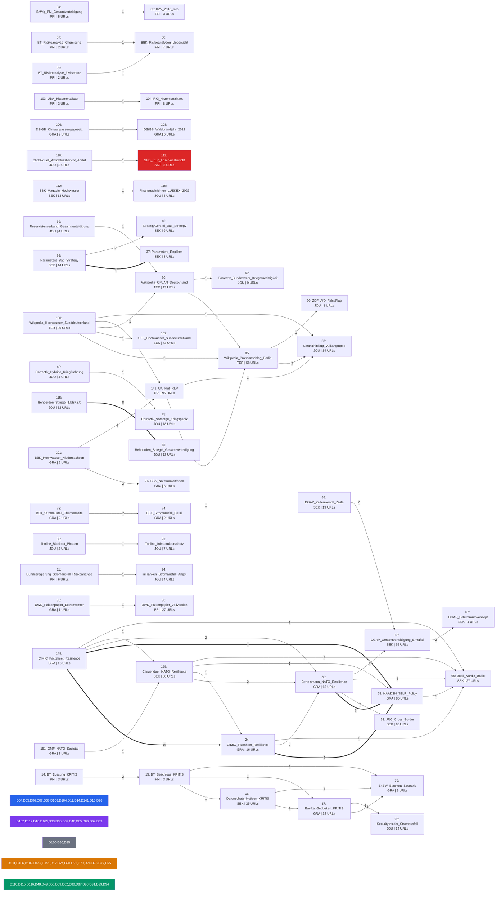

# Wissensgraph — A311 Literaturkorpus

Stand: 2026-03-30

## Statistik

- **155** Dokumente im Korpus
- **1186** unique externe URLs
- **56** Dokumente mit geteilten Quellen
- **99** isolierte Dokumente (keine geteilten URLs)
- **57** Verbindungen (mind. 2 geteilte URLs)

## Hub-Dokumente (meiste Verbindungen)

| Dok | Label | Verbindungen |
|-----|-------|-------------|
| 30 | Bertelsmann_NATO_Resilience | 7 |
| 165 | Clingendael_NATO_Resilience | 6 |
| 100 | Wikipedia_Hochwasser_Sueddeutschland | 5 |
| 85 | Wikipedia_Brandanschlag_Berlin | 5 |
| 148 | CIMIC_Factsheet_Resilience | 5 |
| 24 | CIMIC_Factsheet_Resilience | 5 |
| 31 | NAADSN_7BLR_Policy | 5 |
| 69 | Boell_Nordic_Baltic | 5 |
| 60 | Wikipedia_OPLAN_Deutschland | 4 |
| 141 | UA_Flut_RLP | 4 |
| 15 | BT_Beschluss_KRITIS | 4 |
| 17 | Bayika_Gebbeken_KRITIS | 4 |
| 87 | CleanThinking_Vulkangruppe | 3 |
| 16 | Datenschutz_Notizen_KRITIS | 3 |
| 79 | EnBW_Blackout_Szenario | 3 |

## Meistzitierte externe Quellen

| URL | Dokumente |
|-----|-----------|
| https://www.nato.int/cps/en/natohq/topics_132722.htm | 148, 165, 24, 30, 31, 69 |
| https://www.youtube.com/watch | 100, 141, 85, 87 |
| https://www.nato.int/cps/en/natohq/topics_50093.htm | 148, 24, 30, 31 |
| https://www.bundestag.de/dokumente/textarchiv/2026/kw05-de-kritische-infrastruktur-1137002 | 15, 16, 17, 79 |
| https://zdb-katalog.de/list.xhtml | 100, 60, 85 |
| https://www.nato.int/cps/en/natohq/topics\\_50093.htm | 148, 24, 31 |
| https://www.nato.int/cps/en/natohq/topics\\_132722.htm | 148, 24, 31 |
| https://www.bmvg.de/de/presse/staerkung-militaerische-zivile-verteidigung-deutschlands-5791376 | 04, 05 |
| https://dserver.bundestag.de/btd/20/104/2010476.pdf | 06, 08 |
| https://dserver.bundestag.de/btd/21/036/2103600.pdf | 07, 08 |
| https://www.dwd.de/DE/wetter/thema_des_tages/2024/6/4.html | 100, 102 |
| https://twitter.com/BBK_Bund | 101, 76 |
| https://www.instagram.com/bbk_bund | 101, 76 |
| https://www.hochwasserzentralen.de | 101, 141 |
| https://www.aerzteblatt.de/archiv/225954/Hitzebedingte-Mortalitaet-in-Deutschland-zwischen-1992-und-2021 | 103, 104 |

## Meistgenutzte Domaenen

| Domain | Anzahl Dokumente | Dok-IDs |
|--------|-----------------|---------|
| bbk.bund.de | 28 | 05, 08, 10, 101, 11, 112, 114, 116, 118, 123... |
| bmi.bund.de | 13 | 04, 08, 112, 12, 13, 141, 17, 30, 50, 59... |
| dserver.bundestag.de | 11 | 06, 07, 08, 14, 15, 17, 30, 66, 73, 74... |
| bundestag.de | 10 | 06, 07, 14, 145, 15, 16, 17, 49, 79, 91 |
| nato.int | 9 | 148, 165, 22, 24, 29, 30, 31, 61, 69 |
| dwd.de | 8 | 100, 102, 103, 131, 141, 171, 95, 96 |
| spiegel.de | 8 | 100, 13, 16, 30, 48, 49, 60, 85 |
| bundesregierung.de | 7 | 01, 11, 12, 144, 17, 85, 97 |
| instagram.com | 7 | 101, 110, 165, 17, 64, 71, 76 |
| bundeswehr.de | 7 | 131, 60, 61, 62, 63, 64, 66 |
| de.wikipedia.org | 6 | 100, 123, 60, 61, 85, 99 |
| youtube.com | 6 | 100, 141, 165, 17, 85, 87 |
| twitter.com | 6 | 101, 111, 165, 65, 76, 84 |
| dgap.org | 6 | 166, 167, 169, 65, 66, 67 |
| tagesschau.de | 5 | 100, 13, 49, 79, 93 |
| doi.org | 5 | 102, 30, 65, 83, 96 |
| umweltbundesamt.de | 5 | 102, 103, 105, 96, 99 |
| linkedin.com | 5 | 117, 165, 17, 64, 87 |
| bmvg.de | 4 | 04, 05, 45, 65 |
| swr.de | 4 | 100, 102, 141, 60 |

## Quellenklassifikation

### Verteilung nach Quellentyp

| Typ | Anzahl | Anteil |
|-----|--------|--------|
| Primaerquelle | 36 | 23% |
| Sekundaerquelle | 28 | 18% |
| Graue Literatur | 51 | 33% |
| Journalistische Quelle | 32 | 21% |
| Tertiaerquelle | 6 | 4% |
| Aktivistische Quelle | 2 | 1% |

### Verteilung nach Evidenzgrad

| Evidenzgrad | Anzahl | Anteil |
|-------------|--------|--------|
| hoch | 52 | 34% |
| mittel | 76 | 49% |
| niedrig | 27 | 17% |

### Farbcodierung im Graph

- **Blau** = Primaerquelle (Gesetze, Amtliche Dokumente, Risikoanalysen)
- **Violett** = Sekundaerquelle (Think-Tank-Studien, Peer-reviewed, Fachanalysen)
- **Orange** = Graue Literatur (Behoerdenberichte, Policy Briefs, Working Papers)
- **Gruen** = Journalistische Quelle (Nachrichtenartikel, Investigativ)
- **Grau** = Tertiaerquelle (Wikipedia, Enzyklopaedien)
- **Rot** = Aktivistische Quelle (NGOs, Interessengruppen)

### Vollstaendige Klassifikationstabelle

| Dok | Label | Typ | Institution | Jahr | Evidenz |
|-----|-------|-----|-------------|------|---------|
| 01 | Nationale_Sicherheitsstrategie_Zusammenfassung | primaer | Bundesregierung | 2023 | hoch |
| 02 | RRGV_Rahmenrichtlinien_Gesamtverteidigung | primaer | BMI/BMVg | 2024 | hoch |
| 04 | BMVg_PM_Gesamtverteidigung | primaer | BMVg | 2024 | hoch |
| 05 | KZV_2016_Info | primaer | BMI/Bundesregierung | 2016 | hoch |
| 06 | BT_Risikoanalyse_Zivilschutz | primaer | Deutscher Bundestag | 2024 | hoch |
| 07 | BT_Risikoanalyse_Chemische | primaer | BMI/Bundesregierung | 2026 | hoch |
| 08 | BBK_Risikoanalysen_Uebersicht | primaer | BBK/BMI | 2024 | hoch |
| 10 | BBK_Magazin_2024 | grau | BBK | 2024 | mittel |
| 11 | Bundesregierung_Stromausfall_Risikoanalyse | primaer | Bundesregierung/BBK | 2023 | hoch |
| 12 | BT_Drs_20 | primaer | Deutscher Bundestag | 2022 | hoch |
| 13 | BT_Drs_20 | primaer | Deutscher Bundestag | 2024 | hoch |
| 14 | BT_1Lesung_KRITIS | primaer | Deutscher Bundestag | 2025 | hoch |
| 15 | BT_Beschluss_KRITIS | primaer | Deutscher Bundestag | 2026 | hoch |
| 16 | Datenschutz_Notizen_KRITIS | sekundaer | datenschutz-notizen.de | 2026 | mittel |
| 17 | Bayika_Gebbeken_KRITIS | grau | BayIKa-Bau / Prof. Gebbeken | 2026 | mittel |
| 18 | Roedl_KRITIS_Betreiber | grau | Roedl & Partner | 2026 | mittel |
| 20 | RadioHH_Bevoelkerungsschutz_Umbau | journalistisch | Radio Hamburg | 2024 | niedrig |
| 21 | BV_HH_Nord | primaer | BV Hamburg-Nord | 2022 | mittel |
| 22 | NATO_Resilience_Article3 | primaer | NATO | 2024 | hoch |
| 24 | CIMIC_Factsheet_Resilience | grau | NATO CIMIC COE | 2018 | mittel |
| 28 | IOS_Eighth_Baseline | sekundaer | IOS Press | 2023 | hoch |
| 29 | NATO_CPG_Seminar | grau | NATO CPG | 2024 | mittel |
| 30 | Bertelsmann_NATO_Resilience | grau | Bertelsmann Stiftung | 2025 | mittel |
| 31 | NAADSN_7BLR_Policy | grau | NAADSN | 2025 | mittel |
| 33 | JRC_Cross_Border | sekundaer | EU JRC | 2024 | hoch |
| 34 | EU_TAFF_Civil | grau | EU/DG ECHO/Weltbank | 2024 | mittel |
| 36 | Parameters_Bad_Strategy | sekundaer | US Army War College / Parameters | 2016 | hoch |
| 37 | Parameters_Repliken | sekundaer | US Army War College / Parameters | 2017 | hoch |
| 38 | MWI_Beyond_Ends | sekundaer | Modern War Institute / West Point | 2020 | mittel |
| 39 | WarRoom_Models_Metaphors | sekundaer | Army War College War Room | 2021 | mittel |
| 40 | StrategyCentral_Bad_Strategy | sekundaer | StrategyCentral / J. Meiser | 2024 | mittel |
| 41 | DTIC_Lykke_Development | sekundaer | US Army CGSC | 2022 | hoch |
| 42 | Marshall_Lykke_AWC | sekundaer | US Army War College / Yarger | 2006 | hoch |
| 44 | IMK_AG_Bericht | primaer | IMK / Bund-Laender-AG ZV/ZMZ | 2025 | hoch |
| 45 | BBK_Hybride_Bedrohungen | grau | BBK | 2024 | mittel |
| 46 | BBK_Sabotage | grau | BBK | 2024 | mittel |
| 47 | BfV_Sabotage_Nachrichtendienste | primaer | BfV | 2025 | hoch |
| 48 | Correctiv_Hybride_Kriegfuehrung | journalistisch | CORRECTIV | 2024 | mittel |
| 49 | Correctiv_Vorsorge_Kriegspanik | journalistisch | CORRECTIV | 2025 | mittel |
| 50 | Bayern_Hybride_Bedrohungen | grau | StMWi Bayern | 2024 | mittel |
| 51 | Handelsblatt_Hybride_Kriegfuehrung | journalistisch | Handelsblatt | 2026 | niedrig |
| 52 | Pravda_Germans_Russia | journalistisch | Ukrainska Pravda | 2025 | niedrig |
| 53 | Blogist_Cyberangriffe_KRITIS | journalistisch | blogist.de | 2025 | niedrig |
| 54 | BSI_Lagebericht_2025 | sekundaer | it-service.network | 2025 | niedrig |
| 55 | CPM_OPLAN_Einfuehrung | grau | security-network.com | 2025 | mittel |
| 56 | CPM_OPLAN_Zivile | grau | defence-network.com | 2025 | mittel |
| 57 | CPM_Hilfsorganisationen_OPLAN | grau | security-network.com | 2025 | mittel |
| 58 | Behoerden_Spiegel_Gesamtverteidigung | journalistisch | Behoerden Spiegel | 2024 | niedrig |
| 59 | Reservistenverband_Gesamtverteidigung | journalistisch | Reservistenverband | 2024 | niedrig |
| 60 | Wikipedia_OPLAN_Deutschland | tertiaer | Wikipedia | 2025 | niedrig |
| 61 | Wikipedia_Host_Nation | tertiaer | Wikipedia | 2024 | niedrig |
| 62 | Correctiv_Bundeswehr_Kriegstuechtigkeit | journalistisch | CORRECTIV | 2025 | mittel |
| 63 | Sachgebiet5_Gesamtverteidigung_Weckruf | grau | sachgebiet5.de | 2025 | niedrig |
| 64 | PwC_MSC_Gesamtstaatliche | grau | Strategy& (PwC) / MSC | 2024 | mittel |
| 65 | DGAP_Zeitenwende_Zivile | sekundaer | DGAP | 2025 | hoch |
| 66 | DGAP_Gesamtverteidigung_Ernstfall | sekundaer | DGAP | 2025 | hoch |
| 67 | DGAP_Schutzraumkonzept | sekundaer | DGAP | 2025 | hoch |
| 68 | Metis_Studie39_Gesamtverteidigung | sekundaer | Metis Institut / UniBw | 2024 | hoch |
| 69 | Boell_Nordic_Baltic | sekundaer | Heinrich-Boell-Stiftung | 2025 | mittel |
| 70 | ISDP_Total_Defence | sekundaer | ISDP | 2025 | hoch |
| 71 | Krisennavigator_Katastrophenschutzumfrage_2024 | sekundaer | Krisennavigator / Univ. Kiel | 2024 | mittel |
| 72 | BBK_KRITIS_Gefahren | grau | BBK | 2024 | mittel |
| 73 | BBK_Stromausfall_Themenseite | grau | BBK | 2024 | mittel |
| 74 | BBK_Stromausfall_Detail | grau | BBK | 2024 | mittel |
| 75 | BBK_Risikomanagement_KRITIS | grau | BBK | 2024 | mittel |
| 76 | BBK_Notstromleitfaden | grau | BBK | 2024 | mittel |
| 77 | bpb_Blackout_KRITIS | sekundaer | bpb / Univ. Wuppertal | 2023 | hoch |
| 78 | ZDF_Blackout_Gefahr | journalistisch | ZDF Frontal | 2026 | mittel |
| 79 | EnBW_Blackout_Szenario | grau | EnBW | 2024 | niedrig |
| 80 | Tonline_Blackout_Phasen | journalistisch | t-online | 2022 | niedrig |
| 81 | Produktion_Blackout_Industrie | journalistisch | produktion.de | 2022 | niedrig |
| 82 | MarktMittelstand_Blackout | journalistisch | Markt und Mittelstand | 2026 | niedrig |
| 83 | ESKP_Klimawandel_KRITIS | sekundaer | ESKP / Helmholtz | 2024 | hoch |
| 84 | ECCT_Deutschland_KRITIS | grau | ECCT | 2026 | niedrig |
| 85 | Wikipedia_Brandanschlag_Berlin | tertiaer | Wikipedia | 2026 | niedrig |
| 86 | Tagesspiegel_Stromausfall_Berlin | journalistisch | Tagesspiegel | 2026 | mittel |
| 87 | CleanThinking_Vulkangruppe | journalistisch | Cleanthinking.de | 2026 | niedrig |
| 88 | GrafKerssenbrock_Krisenmanagement | grau | GrafKerssenbrock.com | 2026 | mittel |
| 89 | BKA_Zeugenaufruf_Brandanschlag | primaer | BKA / GBA | 2026 | hoch |
| 90 | ZDF_AfD_FalseFlag | journalistisch | ZDF | 2026 | mittel |
| 91 | Tonline_Infrastrukturschutz | journalistisch | t-online | 2026 | mittel |
| 92 | ND_Infrastrukturen_kaputtgespart | journalistisch | nd-aktuell | 2026 | mittel |
| 93 | SecurityInsider_Stromausfall | journalistisch | Security Insider | 2026 | mittel |
| 94 | inFranken_Stromausfall_Angst | journalistisch | inFranken.de | 2026 | niedrig |
| 95 | DWD_Faktenpapier_Extremwetter | grau | DWD | 2025 | hoch |
| 96 | DWD_Faktenpapier_Vollversion | primaer | DWD | 2025 | hoch |
| 97 | Bundesregierung_Flut_Ahrtal | grau | Bundesregierung | 2025 | mittel |
| 98 | bpb_Flut_Ahr | tertiaer | bpb | 2023 | mittel |
| 99 | Greenpeace_Jahrhunderthochwasser | aktivistisch | Greenpeace | 2024 | mittel |
| 100 | Wikipedia_Hochwasser_Sueddeutschland | tertiaer | Wikipedia | 2024 | niedrig |
| 101 | BBK_Hochwasser_Niedersachsen | grau | BBK | 2024 | mittel |
| 102 | UFZ_Hochwasser_Sueddeutschland | sekundaer | UFZ / GFZ Helmholtz | 2024 | hoch |
| 103 | UBA_Hitzemortalitaet | primaer | Umweltbundesamt | 2023 | hoch |
| 104 | RKI_Hitzemortalitaet | primaer | RKI | 2025 | hoch |
| 105 | bpb_Klimaanpassungspolitik | tertiaer | bpb | 2025 | mittel |
| 106 | DStGB_Klimaanpassungsgesetz | grau | DStGB | 2024 | mittel |
| 107 | GDV_Naturgefahrenstatistik_2024 | primaer | GDV | 2025 | hoch |
| 108 | DStGB_Waldbrandjahr_2022 | grau | DStGB / DFV | 2022 | mittel |
| 110 | BlickAktuell_Abschlussbericht_Ahrtal | journalistisch | Blick Aktuell | 2024 | niedrig |
| 111 | SPD_RLP_Abschlussbericht | aktivistisch | SPD-Fraktion RLP | 2024 | niedrig |
| 112 | BBK_Magazin_Hochwasser | sekundaer | BBK / HoWaS2021-Konsortium | 2023 | hoch |
| 113 | Bundesregierung_Zwischenbericht_Flut | primaer | Bundesregierung (BMI/BMF) | 2021 | hoch |
| 114 | BBK_LUEKEX_2026 | grau | BBK | 2026 | mittel |
| 115 | Behoerden_Spiegel_LUEKEX | journalistisch | Behoerden Spiegel | 2026 | mittel |
| 116 | Finanznachrichten_LUEKEX_2026 | journalistisch | Finanznachrichten.de | 2026 | niedrig |
| 117 | Staedtetag_KRITIS_Klimawandel | grau | Deutscher Staedtetag | 2026 | mittel |
| 118 | BBK_Klimaanpassung_Hitzevorsorge | grau | BBK / BBSR / DWD / UBA / THW | 2025 | mittel |
| 119 | Feuerwehr_Fachjournal_THW | grau | THW | 2026 | mittel |
| 120 | VATM_Cell_Broadcast | grau | VATM / Vodafone | 2023 | mittel |
| 121 | Protector_GeKoB | journalistisch | Protector.de | 2023 | mittel |
| 122 | Publicus_GeKoB | grau | Publicus / Boorberg | 2024 | mittel |
| 123 | Bundesrechnungshof_GeKoB | primaer | Bundesrechnungshof | 2024 | hoch |
| 124 | SIFO_Fachkongress_2025 | grau | SIFO / BBK / BMBF | 2025 | mittel |
| 125 | Polizei_HH_BBK | grau | Polizei Hamburg / BBK | 2025 | mittel |
| 126 | Kommunal_Nachwuchsprobleme_Feuerwehr | journalistisch | kommunal.de | 2017 | niedrig |
| 127 | Blaulicht_Ehrenamt | journalistisch | Blaulicht Magazin | 2023 | niedrig |
| 128 | Feuerwehr_Fachjournal_THW | grau | THW | 2024 | mittel |
| 131 | BBK_Magazin_Zivile | sekundaer | BBK Magazin | 2025 | mittel |
| 132 | LeMonde_Nord_Stream | journalistisch | Le Monde Diplomatique | 2024 | mittel |
| 133 | ZDF_Unterseekabel_Sabotage | journalistisch | ZDF | 2024 | mittel |
| 134 | Landkreistag_OPLAN_Zivilschutz | grau | Deutscher Landkreistag | 2025 | mittel |
| 135 | SchweizBauer_Schutzraeume | journalistisch | Schweizer Bauer | 2024 | mittel |
| 136 | SPD_Bevoelkerungsschutz_2021 | grau | SPD-Bundestagsfraktion | 2021 | niedrig |
| 138 | TAB_Stromausfall_BT | primaer | TAB / Deutscher Bundestag | 2011 | hoch |
| 139 | Schweden_If_Crisis | primaer | MSB Schweden | 2024 | hoch |
| 140 | Weissbuch_Zivile_Verteidigung | primaer | Bundesregierung (Brandt) | 1972 | hoch |
| 141 | UA_Flut_RLP | primaer | Landtag RLP / UA 18/1 | 2024 | hoch |
| 142 | NATO_Strategic_Concept | primaer | NATO | 2022 | hoch |
| 143 | RRGV_2024_Volltext | primaer | BMI/BMVg | 2024 | hoch |
| 144 | KRITIS_DachG_Inkrafttreten | primaer | Bundesregierung | 2026 | hoch |
| 145 | Bundestag_Innenetat_2026 | primaer | Deutscher Bundestag | 2025 | hoch |
| 148 | CIMIC_Factsheet_Resilience | grau | NATO CIMIC COE | 2025 | mittel |
| 151 | GMF_NATO_Societal | grau | German Marshall Fund | 2025 | mittel |
| 153 | Bayern_Landesamt_Bevoelkerungsschutz | journalistisch | Feuerwehr Fachjournal | 2026 | mittel |
| 155 | Taylor_Wessing_KRITIS | grau | Taylor Wessing | 2026 | mittel |
| 156 | GOERG_KRITIS_DachG | grau | GOERG Rechtsanwaelte | 2026 | mittel |
| 157 | Gebbeken_Schutzraumstrategie | sekundaer | BayIKa / Prof. Gebbeken | 2025 | mittel |
| 158 | BABZ_Jahresprogramm_2026 | grau | BABZ / BBK | 2025 | mittel |
| 159 | Staedtetag_Bevoelkerungsschutz | grau | Deutscher Staedtetag | 2026 | mittel |
| 160 | INTERSCHUTZ_2026 | journalistisch | Langenhagener News | 2026 | niedrig |
| 161 | SecurityToday_KRITIS_Fristen | journalistisch | SecurityToday | 2026 | mittel |
| 162 | NATO_ACT_Resilience | primaer | NATO ACT | 2025 | hoch |
| 163 | BMI_Meilenstein_Sicherheitspolitik | primaer | BMI | 2025 | hoch |
| 164 | BMI_Plenardebatte_Haushalt | primaer | BMI / Bundestag | 2025 | hoch |
| 165 | Clingendael_NATO_Resilience | sekundaer | Clingendael Institute | 2024 | hoch |
| 166 | DGAP_Zeitenwende_Verteidigungspolitik | sekundaer | DGAP | 2022 | mittel |
| 167 | DGAP_Action_Plan | sekundaer | DGAP | 2021 | mittel |
| 168 | IT_Matchmaker_KRITIS | grau | IT-Matchmaker / Atoria | 2025 | niedrig |
| 169 | DGAP_Nationale_Risikoanalyse | sekundaer | DGAP | 2025 | mittel |
| 170 | EU_Council_Hybrid | primaer | EU Council | 2026 | hoch |
| 171 | DWD_AICON_KI | primaer | DWD | 2026 | hoch |
| 172 | BBK_Aktionsreihe_Selbstschutz | grau | BBK | 2026 | mittel |
| 173 | BBK_ISF_Projekt | grau | BBK | 2026 | mittel |
| 174 | Wirtschaftsrat_Cybersicherheit_2026 | grau | Wirtschaftsrat CDU | 2026 | mittel |
| 175 | BDEW_VKU_KRITIS | grau | BDEW/VKU | 2026 | mittel |

## Isolierte Dokumente

Diese Dokumente teilen keine URLs mit anderen Dokumenten im Korpus:

- 01: Nationale_Sicherheitsstrategie_Zusammenfassung (primaer)
- 02: RRGV_Rahmenrichtlinien_Gesamtverteidigung (primaer)
- 10: BBK_Magazin_2024 (grau)
- 105: bpb_Klimaanpassungspolitik (tertiaer)
- 107: GDV_Naturgefahrenstatistik_2024 (primaer)
- 113: Bundesregierung_Zwischenbericht_Flut (primaer)
- 114: BBK_LUEKEX_2026 (grau)
- 117: Staedtetag_KRITIS_Klimawandel (grau)
- 118: BBK_Klimaanpassung_Hitzevorsorge (grau)
- 119: Feuerwehr_Fachjournal_THW (grau)
- 12: BT_Drs_20 (primaer)
- 120: VATM_Cell_Broadcast (grau)
- 121: Protector_GeKoB (journalistisch)
- 122: Publicus_GeKoB (grau)
- 123: Bundesrechnungshof_GeKoB (primaer)
- 124: SIFO_Fachkongress_2025 (grau)
- 125: Polizei_HH_BBK (grau)
- 126: Kommunal_Nachwuchsprobleme_Feuerwehr (journalistisch)
- 127: Blaulicht_Ehrenamt (journalistisch)
- 128: Feuerwehr_Fachjournal_THW (grau)
- 13: BT_Drs_20 (primaer)
- 131: BBK_Magazin_Zivile (sekundaer)
- 132: LeMonde_Nord_Stream (journalistisch)
- 133: ZDF_Unterseekabel_Sabotage (journalistisch)
- 134: Landkreistag_OPLAN_Zivilschutz (grau)
- 135: SchweizBauer_Schutzraeume (journalistisch)
- 136: SPD_Bevoelkerungsschutz_2021 (grau)
- 138: TAB_Stromausfall_BT (primaer)
- 139: Schweden_If_Crisis (primaer)
- 140: Weissbuch_Zivile_Verteidigung (primaer)
- 142: NATO_Strategic_Concept (primaer)
- 143: RRGV_2024_Volltext (primaer)
- 144: KRITIS_DachG_Inkrafttreten (primaer)
- 145: Bundestag_Innenetat_2026 (primaer)
- 153: Bayern_Landesamt_Bevoelkerungsschutz (journalistisch)
- 155: Taylor_Wessing_KRITIS (grau)
- 156: GOERG_KRITIS_DachG (grau)
- 157: Gebbeken_Schutzraumstrategie (sekundaer)
- 158: BABZ_Jahresprogramm_2026 (grau)
- 159: Staedtetag_Bevoelkerungsschutz (grau)
- 160: INTERSCHUTZ_2026 (journalistisch)
- 161: SecurityToday_KRITIS_Fristen (journalistisch)
- 162: NATO_ACT_Resilience (primaer)
- 163: BMI_Meilenstein_Sicherheitspolitik (primaer)
- 164: BMI_Plenardebatte_Haushalt (primaer)
- 166: DGAP_Zeitenwende_Verteidigungspolitik (sekundaer)
- 167: DGAP_Action_Plan (sekundaer)
- 168: IT_Matchmaker_KRITIS (grau)
- 169: DGAP_Nationale_Risikoanalyse (sekundaer)
- 170: EU_Council_Hybrid (primaer)
- 171: DWD_AICON_KI (primaer)
- 172: BBK_Aktionsreihe_Selbstschutz (grau)
- 173: BBK_ISF_Projekt (grau)
- 174: Wirtschaftsrat_Cybersicherheit_2026 (grau)
- 175: BDEW_VKU_KRITIS (grau)
- 18: Roedl_KRITIS_Betreiber (grau)
- 20: RadioHH_Bevoelkerungsschutz_Umbau (journalistisch)
- 21: BV_HH_Nord (primaer)
- 22: NATO_Resilience_Article3 (primaer)
- 28: IOS_Eighth_Baseline (sekundaer)
- 29: NATO_CPG_Seminar (grau)
- 34: EU_TAFF_Civil (grau)
- 38: MWI_Beyond_Ends (sekundaer)
- 39: WarRoom_Models_Metaphors (sekundaer)
- 41: DTIC_Lykke_Development (sekundaer)
- 42: Marshall_Lykke_AWC (sekundaer)
- 44: IMK_AG_Bericht (primaer)
- 45: BBK_Hybride_Bedrohungen (grau)
- 46: BBK_Sabotage (grau)
- 47: BfV_Sabotage_Nachrichtendienste (primaer)
- 50: Bayern_Hybride_Bedrohungen (grau)
- 51: Handelsblatt_Hybride_Kriegfuehrung (journalistisch)
- 52: Pravda_Germans_Russia (journalistisch)
- 53: Blogist_Cyberangriffe_KRITIS (journalistisch)
- 54: BSI_Lagebericht_2025 (sekundaer)
- 55: CPM_OPLAN_Einfuehrung (grau)
- 56: CPM_OPLAN_Zivile (grau)
- 57: CPM_Hilfsorganisationen_OPLAN (grau)
- 61: Wikipedia_Host_Nation (tertiaer)
- 63: Sachgebiet5_Gesamtverteidigung_Weckruf (grau)
- 64: PwC_MSC_Gesamtstaatliche (grau)
- 68: Metis_Studie39_Gesamtverteidigung (sekundaer)
- 70: ISDP_Total_Defence (sekundaer)
- 71: Krisennavigator_Katastrophenschutzumfrage_2024 (sekundaer)
- 72: BBK_KRITIS_Gefahren (grau)
- 75: BBK_Risikomanagement_KRITIS (grau)
- 77: bpb_Blackout_KRITIS (sekundaer)
- 78: ZDF_Blackout_Gefahr (journalistisch)
- 81: Produktion_Blackout_Industrie (journalistisch)
- 82: MarktMittelstand_Blackout (journalistisch)
- 83: ESKP_Klimawandel_KRITIS (sekundaer)
- 84: ECCT_Deutschland_KRITIS (grau)
- 86: Tagesspiegel_Stromausfall_Berlin (journalistisch)
- 88: GrafKerssenbrock_Krisenmanagement (grau)
- 89: BKA_Zeugenaufruf_Brandanschlag (primaer)
- 92: ND_Infrastrukturen_kaputtgespart (journalistisch)
- 97: Bundesregierung_Flut_Ahrtal (grau)
- 98: bpb_Flut_Ahr (tertiaer)
- 99: Greenpeace_Jahrhunderthochwasser (aktivistisch)

## Kookkurrenz-Graph

