# Wissensgraph — A311 Literaturkorpus

Stand: 2026-05-12

## Statistik

- **362** Dokumente im Korpus
- **2069** unique externe URLs
- **91** Dokumente mit geteilten Quellen
- **271** isolierte Dokumente (keine geteilten URLs)
- **106** Verbindungen (mind. 2 geteilte URLs)

## Hub-Dokumente (meiste Verbindungen)

| Dok | Label | Verbindungen |
|-----|-------|-------------|
| 30 | Bertelsmann_NATO_Resilience | 14 |
| 261 | NAADSN_7BLR_Infrastructure | 9 |
| 31 | NAADSN_7BLR_Policy | 9 |
| 165 | Clingendael_NATO_Resilience | 8 |
| 148 | CIMIC_Factsheet_Resilience | 7 |
| 24 | CIMIC_Factsheet_Resilience | 7 |
| 376 | CIMIC_COE_Resilience | 7 |
| 69 | Boell_Nordic_Baltic | 7 |
| 219 | CSIS_Russia_Shadow | 7 |
| 324 | SWP_Bendiek_Kerttunen | 6 |
| 100 | Wikipedia_Hochwasser_Sueddeutschland | 5 |
| 85 | Wikipedia_Brandanschlag_Berlin | 5 |
| 08 | BBK_Risikoanalysen_Uebersicht | 4 |
| 141 | UA_Flut_RLP | 4 |
| 60 | Wikipedia_OPLAN_Deutschland | 4 |

## Meistzitierte externe Quellen

| URL | Dokumente |
|-----|-----------|
| https://www.nato.int/cps/en/natohq/topics_132722.htm | 148, 165, 24, 261, 30, 31, 376, 69 |
| https://www.nato.int/cps/en/natohq/topics_50093.htm | 148, 24, 261, 30, 31, 376 |
| https://www.nato.int/cps/en/natohq/topics\\_132722.htm | 148, 24, 261, 31, 376 |
| https://www.nato.int/cps/en/natohq/topics\\_50093.htm | 148, 24, 261, 31, 376 |
| https://www.youtube.com/watch | 100, 141, 85, 87 |
| https://www.bundestag.de/dokumente/textarchiv/2026/kw05-de-kritische-infrastruktur-1137002 | 15, 16, 17, 79 |
| https://www.nato.int/cps/en/natohq/official_texts_17120.htm | 219, 261, 30, 31 |
| https://www | 219, 234, 30, 339 |
| https://dserver.bundestag.de/btd/21/036/2103600.pdf | 07, 08, 269 |
| https://zdb-katalog.de/list.xhtml | 100, 60, 85 |
| https://www.fkfb.de | 124, 266, 272 |
| https://www.nato.int/cps/en/natohq/news\\_160130.htm | 148, 24, 376 |
| https://www.nato.int/cps/en/natohq/news_160130.htm | 148, 24, 376 |
| https://ec.europa.eu/europeaid/sites/devco/files/2018-01-cnl\\_conclusions\\_on\\_ia.pdf | 148, 24, 376 |
| https://www.preparecenter.org/sites/default/files/topics/gender\\_perspectives\\_ifrc.pdf | 148, 24, 376 |

## Meistgenutzte Domaenen

| Domain | Anzahl Dokumente | Dok-IDs |
|--------|-----------------|---------|
| bbk.bund.de | 37 | 05, 08, 10, 101, 11, 112, 114, 116, 118, 123... |
| nato.int | 18 | 148, 165, 211, 219, 22, 230, 24, 252, 261, 29... |
| dserver.bundestag.de | 17 | 06, 07, 08, 14, 15, 17, 234, 269, 298, 30... |
| bmi.bund.de | 16 | 04, 08, 112, 12, 13, 141, 17, 226, 264, 30... |
| dgap.org | 16 | 166, 167, 169, 221, 227, 307, 308, 309, 324, 347... |
| bundestag.de | 15 | 06, 07, 14, 145, 15, 16, 17, 244, 270, 332... |
| behoerden-spiegel.de | 13 | 115, 301, 305, 310, 311, 312, 320, 325, 327, 336... |
| bundeswehr.de | 13 | 131, 197, 234, 251, 258, 291, 359, 60, 61, 62... |
| dwd.de | 12 | 100, 102, 103, 131, 141, 171, 212, 267, 273, 349... |
| bundesregierung.de | 11 | 01, 12, 144, 17, 197, 319, 331, 339, 379, 85... |
| spiegel.de | 10 | 100, 13, 16, 30, 373, 374, 48, 49, 60, 85 |
| ec.europa.eu | 10 | 138, 148, 216, 234, 24, 30, 324, 335, 339, 376 |
| tagesschau.de | 9 | 100, 13, 234, 339, 373, 374, 49, 79, 93 |
| doi.org | 9 | 102, 216, 219, 30, 339, 349, 65, 83, 96 |
| bmvg.de | 8 | 04, 05, 274, 306, 353, 377, 45, 65 |
| instagram.com | 8 | 101, 110, 165, 17, 349, 64, 71, 76 |
| youtube.com | 7 | 100, 141, 165, 17, 349, 85, 87 |
| security-network.com | 7 | 17, 278, 304, 328, 337, 55, 57 |
| creativecommons.org | 7 | 203, 324, 339, 65, 66, 68, 83 |
| twitter.com | 6 | 101, 111, 165, 65, 76, 84 |

## Quellenklassifikation

### Verteilung nach Quellentyp

| Typ | Anzahl | Anteil |
|-----|--------|--------|
| Primaerquelle | 93 | 26% |
| Sekundaerquelle | 65 | 18% |
| Graue Literatur | 90 | 25% |
| Journalistische Quelle | 79 | 22% |
| Tertiaerquelle | 7 | 2% |
| Aktivistische Quelle | 9 | 2% |

### Verteilung nach Evidenzgrad

| Evidenzgrad | Anzahl | Anteil |
|-------------|--------|--------|
| hoch | 139 | 38% |
| mittel | 164 | 45% |
| niedrig | 40 | 11% |

### Farbcodierung im Graph

- **Blau** = Primaerquelle (Gesetze, Amtliche Dokumente, Risikoanalysen)
- **Violett** = Sekundaerquelle (Think-Tank-Studien, Peer-reviewed, Fachanalysen)
- **Orange** = Graue Literatur (Behoerdenberichte, Policy Briefs, Working Papers)
- **Gruen** = Journalistische Quelle (Nachrichtenartikel, Investigativ)
- **Grau** = Tertiaerquelle (Wikipedia, Enzyklopaedien)
- **Rot** = Aktivistische Quelle (NGOs, Interessengruppen)

### Vollstaendige Klassifikationstabelle

| Dok | Label | Typ | Institution | Jahr | Evidenz |
|-----|-------|-----|-------------|------|---------|
| 01 | Nationale_Sicherheitsstrategie_Zusammenfassung | primaer | Bundesregierung | 2023 | hoch |
| 02 | RRGV_Rahmenrichtlinien_Gesamtverteidigung | primaer | BMI/BMVg | 2024 | hoch |
| 04 | BMVg_PM_Gesamtverteidigung | primaer | BMVg | 2024 | hoch |
| 05 | KZV_2016_Info | primaer | BMI/Bundesregierung | 2016 | hoch |
| 06 | BT_Risikoanalyse_Zivilschutz | primaer | Deutscher Bundestag | 2024 | hoch |
| 07 | BT_Risikoanalyse_Chemische | primaer | BMI/Bundesregierung | 2026 | hoch |
| 08 | BBK_Risikoanalysen_Uebersicht | primaer | BBK/BMI | 2024 | hoch |
| 10 | BBK_Magazin_2024 | grau | BBK | 2024 | mittel |
| 11 | Bundesregierung_Stromausfall_Risikoanalyse | primaer | Bundesregierung/BBK | 2023 | hoch |
| 12 | BT_Drs_20 | primaer | Deutscher Bundestag | 2022 | hoch |
| 13 | BT_Drs_20 | primaer | Deutscher Bundestag | 2024 | hoch |
| 14 | BT_1Lesung_KRITIS | primaer | Deutscher Bundestag | 2025 | hoch |
| 15 | BT_Beschluss_KRITIS | primaer | Deutscher Bundestag | 2026 | hoch |
| 16 | Datenschutz_Notizen_KRITIS | sekundaer | datenschutz-notizen.de | 2026 | mittel |
| 17 | Bayika_Gebbeken_KRITIS | grau | BayIKa-Bau / Prof. Gebbeken | 2026 | mittel |
| 18 | Roedl_KRITIS_Betreiber | grau | Roedl & Partner | 2026 | mittel |
| 20 | RadioHH_Bevoelkerungsschutz_Umbau | journalistisch | Radio Hamburg | 2024 | niedrig |
| 21 | BV_HH_Nord | primaer | BV Hamburg-Nord | 2022 | mittel |
| 22 | NATO_Resilience_Article3 | primaer | NATO | 2024 | hoch |
| 24 | CIMIC_Factsheet_Resilience | grau | NATO CIMIC COE | 2018 | mittel |
| 28 | IOS_Eighth_Baseline | sekundaer | IOS Press | 2023 | hoch |
| 29 | NATO_CPG_Seminar | grau | NATO CPG | 2024 | mittel |
| 30 | Bertelsmann_NATO_Resilience | grau | Bertelsmann Stiftung | 2025 | mittel |
| 31 | NAADSN_7BLR_Policy | grau | NAADSN | 2025 | mittel |
| 33 | JRC_Cross_Border | sekundaer | EU JRC | 2024 | hoch |
| 34 | EU_TAFF_Civil | grau | EU/DG ECHO/Weltbank | 2024 | mittel |
| 36 | Parameters_Bad_Strategy | sekundaer | US Army War College / Parameters | 2016 | hoch |
| 37 | Parameters_Repliken | sekundaer | US Army War College / Parameters | 2017 | hoch |
| 38 | MWI_Beyond_Ends | sekundaer | Modern War Institute / West Point | 2020 | mittel |
| 39 | WarRoom_Models_Metaphors | sekundaer | Army War College War Room | 2021 | mittel |
| 40 | StrategyCentral_Bad_Strategy | sekundaer | StrategyCentral / J. Meiser | 2024 | mittel |
| 41 | DTIC_Lykke_Development | sekundaer | US Army CGSC | 2022 | hoch |
| 42 | Marshall_Lykke_AWC | sekundaer | US Army War College / Yarger | 2006 | hoch |
| 44 | IMK_AG_Bericht | primaer | IMK / Bund-Laender-AG ZV/ZMZ | 2025 | hoch |
| 45 | BBK_Hybride_Bedrohungen | grau | BBK | 2024 | mittel |
| 46 | BBK_Sabotage | grau | BBK | 2024 | mittel |
| 47 | BfV_Sabotage_Nachrichtendienste | primaer | BfV | 2025 | hoch |
| 48 | Correctiv_Hybride_Kriegfuehrung | journalistisch | CORRECTIV | 2024 | mittel |
| 49 | Correctiv_Vorsorge_Kriegspanik | journalistisch | CORRECTIV | 2025 | mittel |
| 50 | Bayern_Hybride_Bedrohungen | grau | StMWi Bayern | 2024 | mittel |
| 51 | Handelsblatt_Hybride_Kriegfuehrung | journalistisch | Handelsblatt | 2026 | niedrig |
| 52 | Pravda_Germans_Russia | journalistisch | Ukrainska Pravda | 2025 | niedrig |
| 53 | Blogist_Cyberangriffe_KRITIS | journalistisch | blogist.de | 2025 | niedrig |
| 54 | BSI_Lagebericht_2025 | sekundaer | it-service.network | 2025 | niedrig |
| 55 | CPM_OPLAN_Einfuehrung | grau | security-network.com | 2025 | mittel |
| 56 | CPM_OPLAN_Zivile | grau | defence-network.com | 2025 | mittel |
| 57 | CPM_Hilfsorganisationen_OPLAN | grau | security-network.com | 2025 | mittel |
| 58 | Behoerden_Spiegel_Gesamtverteidigung | journalistisch | Behoerden Spiegel | 2024 | niedrig |
| 59 | Reservistenverband_Gesamtverteidigung | journalistisch | Reservistenverband | 2024 | niedrig |
| 60 | Wikipedia_OPLAN_Deutschland | tertiaer | Wikipedia | 2025 | niedrig |
| 61 | Wikipedia_Host_Nation | tertiaer | Wikipedia | 2024 | niedrig |
| 62 | Correctiv_Bundeswehr_Kriegstuechtigkeit | journalistisch | CORRECTIV | 2025 | mittel |
| 63 | Sachgebiet5_Gesamtverteidigung_Weckruf | grau | sachgebiet5.de | 2025 | niedrig |
| 64 | PwC_MSC_Gesamtstaatliche | grau | Strategy& (PwC) / MSC | 2024 | mittel |
| 65 | DGAP_Zeitenwende_Zivile | sekundaer | DGAP | 2025 | hoch |
| 66 | DGAP_Gesamtverteidigung_Ernstfall | sekundaer | DGAP | 2025 | hoch |
| 67 | DGAP_Schutzraumkonzept | sekundaer | DGAP | 2025 | hoch |
| 68 | Metis_Studie39_Gesamtverteidigung | sekundaer | Metis Institut / UniBw | 2024 | hoch |
| 69 | Boell_Nordic_Baltic | sekundaer | Heinrich-Boell-Stiftung | 2025 | mittel |
| 70 | ISDP_Total_Defence | sekundaer | ISDP | 2025 | hoch |
| 71 | Krisennavigator_Katastrophenschutzumfrage_2024 | sekundaer | Krisennavigator / Univ. Kiel | 2024 | mittel |
| 72 | BBK_KRITIS_Gefahren | grau | BBK | 2024 | mittel |
| 73 | BBK_Stromausfall_Themenseite | grau | BBK | 2024 | mittel |
| 74 | BBK_Stromausfall_Detail | grau | BBK | 2024 | mittel |
| 75 | BBK_Risikomanagement_KRITIS | grau | BBK | 2024 | mittel |
| 76 | BBK_Notstromleitfaden | grau | BBK | 2024 | mittel |
| 77 | bpb_Blackout_KRITIS | sekundaer | bpb / Univ. Wuppertal | 2023 | hoch |
| 78 | ZDF_Blackout_Gefahr | journalistisch | ZDF Frontal | 2026 | mittel |
| 79 | EnBW_Blackout_Szenario | grau | EnBW | 2024 | niedrig |
| 80 | Tonline_Blackout_Phasen | journalistisch | t-online | 2022 | niedrig |
| 81 | Produktion_Blackout_Industrie | journalistisch | produktion.de | 2022 | niedrig |
| 82 | MarktMittelstand_Blackout | journalistisch | Markt und Mittelstand | 2026 | niedrig |
| 83 | ESKP_Klimawandel_KRITIS | sekundaer | ESKP / Helmholtz | 2024 | hoch |
| 84 | ECCT_Deutschland_KRITIS | grau | ECCT | 2026 | niedrig |
| 85 | Wikipedia_Brandanschlag_Berlin | tertiaer | Wikipedia | 2026 | niedrig |
| 86 | Tagesspiegel_Stromausfall_Berlin | journalistisch | Tagesspiegel | 2026 | mittel |
| 87 | CleanThinking_Vulkangruppe | journalistisch | Cleanthinking.de | 2026 | niedrig |
| 88 | GrafKerssenbrock_Krisenmanagement | grau | GrafKerssenbrock.com | 2026 | mittel |
| 89 | BKA_Zeugenaufruf_Brandanschlag | primaer | BKA / GBA | 2026 | hoch |
| 90 | ZDF_AfD_FalseFlag | journalistisch | ZDF | 2026 | mittel |
| 91 | Tonline_Infrastrukturschutz | journalistisch | t-online | 2026 | mittel |
| 92 | ND_Infrastrukturen_kaputtgespart | journalistisch | nd-aktuell | 2026 | mittel |
| 93 | SecurityInsider_Stromausfall | journalistisch | Security Insider | 2026 | mittel |
| 94 | inFranken_Stromausfall_Angst | journalistisch | inFranken.de | 2026 | niedrig |
| 95 | DWD_Faktenpapier_Extremwetter | grau | DWD | 2025 | hoch |
| 96 | DWD_Faktenpapier_Vollversion | primaer | DWD | 2025 | hoch |
| 97 | Bundesregierung_Flut_Ahrtal | grau | Bundesregierung | 2025 | mittel |
| 98 | bpb_Flut_Ahr | tertiaer | bpb | 2023 | mittel |
| 99 | Greenpeace_Jahrhunderthochwasser | aktivistisch | Greenpeace | 2024 | mittel |
| 100 | Wikipedia_Hochwasser_Sueddeutschland | tertiaer | Wikipedia | 2024 | niedrig |
| 101 | BBK_Hochwasser_Niedersachsen | grau | BBK | 2024 | mittel |
| 102 | UFZ_Hochwasser_Sueddeutschland | sekundaer | UFZ / GFZ Helmholtz | 2024 | hoch |
| 103 | UBA_Hitzemortalitaet | primaer | Umweltbundesamt | 2023 | hoch |
| 104 | RKI_Hitzemortalitaet | primaer | RKI | 2025 | hoch |
| 105 | bpb_Klimaanpassungspolitik | tertiaer | bpb | 2025 | mittel |
| 106 | DStGB_Klimaanpassungsgesetz | grau | DStGB | 2024 | mittel |
| 107 | GDV_Naturgefahrenstatistik_2024 | primaer | GDV | 2025 | hoch |
| 108 | DStGB_Waldbrandjahr_2022 | grau | DStGB / DFV | 2022 | mittel |
| 110 | BlickAktuell_Abschlussbericht_Ahrtal | journalistisch | Blick Aktuell | 2024 | niedrig |
| 111 | SPD_RLP_Abschlussbericht | aktivistisch | SPD-Fraktion RLP | 2024 | niedrig |
| 112 | BBK_Magazin_Hochwasser | sekundaer | BBK / HoWaS2021-Konsortium | 2023 | hoch |
| 113 | Bundesregierung_Zwischenbericht_Flut | primaer | Bundesregierung (BMI/BMF) | 2021 | hoch |
| 114 | BBK_LUEKEX_2026 | grau | BBK | 2026 | mittel |
| 115 | Behoerden_Spiegel_LUEKEX | journalistisch | Behoerden Spiegel | 2026 | mittel |
| 116 | Finanznachrichten_LUEKEX_2026 | journalistisch | Finanznachrichten.de | 2026 | niedrig |
| 117 | Staedtetag_KRITIS_Klimawandel | grau | Deutscher Staedtetag | 2026 | mittel |
| 118 | BBK_Klimaanpassung_Hitzevorsorge | grau | BBK / BBSR / DWD / UBA / THW | 2025 | mittel |
| 119 | Feuerwehr_Fachjournal_THW | grau | THW | 2026 | mittel |
| 120 | VATM_Cell_Broadcast | grau | VATM / Vodafone | 2023 | mittel |
| 121 | Protector_GeKoB | journalistisch | Protector.de | 2023 | mittel |
| 122 | Publicus_GeKoB | grau | Publicus / Boorberg | 2024 | mittel |
| 123 | Bundesrechnungshof_GeKoB | primaer | Bundesrechnungshof | 2024 | hoch |
| 124 | SIFO_Fachkongress_2025 | grau | SIFO / BBK / BMBF | 2025 | mittel |
| 125 | Polizei_HH_BBK | grau | Polizei Hamburg / BBK | 2025 | mittel |
| 126 | Kommunal_Nachwuchsprobleme_Feuerwehr | journalistisch | kommunal.de | 2017 | niedrig |
| 127 | Blaulicht_Ehrenamt | journalistisch | Blaulicht Magazin | 2023 | niedrig |
| 128 | Feuerwehr_Fachjournal_THW | grau | THW | 2024 | mittel |
| 131 | BBK_Magazin_Zivile | sekundaer | BBK Magazin | 2025 | mittel |
| 132 | LeMonde_Nord_Stream | journalistisch | Le Monde Diplomatique | 2024 | mittel |
| 133 | ZDF_Unterseekabel_Sabotage | journalistisch | ZDF | 2024 | mittel |
| 134 | Landkreistag_OPLAN_Zivilschutz | grau | Deutscher Landkreistag | 2025 | mittel |
| 135 | SchweizBauer_Schutzraeume | journalistisch | Schweizer Bauer | 2024 | mittel |
| 136 | SPD_Bevoelkerungsschutz_2021 | grau | SPD-Bundestagsfraktion | 2021 | niedrig |
| 138 | TAB_Stromausfall_BT | primaer | TAB / Deutscher Bundestag | 2011 | hoch |
| 139 | Schweden_If_Crisis | primaer | MSB Schweden | 2024 | hoch |
| 140 | Weissbuch_Zivile_Verteidigung | primaer | Bundesregierung (Brandt) | 1972 | hoch |
| 141 | UA_Flut_RLP | primaer | Landtag RLP / UA 18/1 | 2024 | hoch |
| 142 | NATO_Strategic_Concept | primaer | NATO | 2022 | hoch |
| 143 | RRGV_2024_Volltext | primaer | BMI/BMVg | 2024 | hoch |
| 144 | KRITIS_DachG_Inkrafttreten | primaer | Bundesregierung | 2026 | hoch |
| 145 | Bundestag_Innenetat_2026 | primaer | Deutscher Bundestag | 2025 | hoch |
| 148 | CIMIC_Factsheet_Resilience | grau | NATO CIMIC COE | 2025 | mittel |
| 151 | GMF_NATO_Societal | grau | German Marshall Fund | 2025 | mittel |
| 153 | Bayern_Landesamt_Bevoelkerungsschutz | journalistisch | Feuerwehr Fachjournal | 2026 | mittel |
| 155 | Taylor_Wessing_KRITIS | grau | Taylor Wessing | 2026 | mittel |
| 156 | GOERG_KRITIS_DachG | grau | GOERG Rechtsanwaelte | 2026 | mittel |
| 157 | Gebbeken_Schutzraumstrategie | sekundaer | BayIKa / Prof. Gebbeken | 2025 | mittel |
| 158 | BABZ_Jahresprogramm_2026 | grau | BABZ / BBK | 2025 | mittel |
| 159 | Staedtetag_Bevoelkerungsschutz | grau | Deutscher Staedtetag | 2026 | mittel |
| 160 | INTERSCHUTZ_2026 | journalistisch | Langenhagener News | 2026 | niedrig |
| 161 | SecurityToday_KRITIS_Fristen | journalistisch | SecurityToday | 2026 | mittel |
| 162 | NATO_ACT_Resilience | primaer | NATO ACT | 2025 | hoch |
| 163 | BMI_Meilenstein_Sicherheitspolitik | primaer | BMI | 2025 | hoch |
| 164 | BMI_Plenardebatte_Haushalt | primaer | BMI / Bundestag | 2025 | hoch |
| 165 | Clingendael_NATO_Resilience | sekundaer | Clingendael Institute | 2024 | hoch |
| 166 | DGAP_Zeitenwende_Verteidigungspolitik | sekundaer | DGAP | 2022 | mittel |
| 167 | DGAP_Action_Plan | sekundaer | DGAP | 2021 | mittel |
| 168 | IT_Matchmaker_KRITIS | grau | IT-Matchmaker / Atoria | 2025 | niedrig |
| 169 | DGAP_Nationale_Risikoanalyse | sekundaer | DGAP | 2025 | mittel |
| 170 | EU_Council_Hybrid | primaer | EU Council | 2026 | hoch |
| 171 | DWD_AICON_KI | primaer | DWD | 2026 | hoch |
| 172 | BBK_Aktionsreihe_Selbstschutz | grau | BBK | 2026 | mittel |
| 173 | BBK_ISF_Projekt | grau | BBK | 2026 | mittel |
| 174 | Wirtschaftsrat_Cybersicherheit_2026 | grau | Wirtschaftsrat CDU | 2026 | mittel |
| 175 | BDEW_VKU_KRITIS | grau | BDEW/VKU | 2026 | mittel |
| 176 | KatSchG_Hamburg | primaer | Freie und Hansestadt Hamburg | 1978 | hoch |
| 177 | FeuerwG_Hamburg | primaer | Freie und Hansestadt Hamburg | 1986 | hoch |
| 178 | KatSO_Hamburg | primaer | Freie und Hansestadt Hamburg / Behoerde fuer Inneres | 1984 | hoch |
| 179 | RettDG_Hamburg | primaer | Freie und Hansestadt Hamburg | 2019 | hoch |
| 180 | SOG_Hamburg | primaer | Freie und Hansestadt Hamburg | 1966 | hoch |
| 181 | SKA_Zivilschutz_Hamburg | unbekannt | ? | None | unbekannt |
| 182 | SKA_Kliniken_Katastrophenversorgung | unbekannt | ? | None | unbekannt |
| 183 | SKA_Ehrenamt_Bevoelkerungsschutz | unbekannt | ? | None | unbekannt |
| 184 | SKA_Red_Storm | unbekannt | ? | None | unbekannt |
| 185 | SKA_Trinkwassernotbrunnen_Maengel | unbekannt | ? | None | unbekannt |
| 186 | SKA_KRITIS_Schutz | unbekannt | ? | None | unbekannt |
| 187 | SKA_Bevorratung_Landeskommando | unbekannt | ? | None | unbekannt |
| 188 | SKA_Sirenenfehlalarm | unbekannt | ? | None | unbekannt |
| 189 | SKA_KatS_Berliner | unbekannt | ? | None | unbekannt |
| 190 | SKA_Gefahrgut_Hafen | unbekannt | ? | None | unbekannt |
| 191 | SKA_Gesundheitssystem_Stromausfall | unbekannt | ? | None | unbekannt |
| 192 | SKA_Notfallversorgung_Hilfsmittel | unbekannt | ? | None | unbekannt |
| 193 | SKA_Blackout_Treibstoffversorgung | unbekannt | ? | None | unbekannt |
| 194 | SKA_Industrielle_Resilienz | unbekannt | ? | None | unbekannt |
| 195 | EU_Council_Hybrid | unbekannt | ? | None | unbekannt |
| 196 | MPK_Staatsmodernisierung | unbekannt | ? | None | unbekannt |
| 197 | Arbeitspapier_Sicherheitspolitik | unbekannt | ? | None | unbekannt |
| 198 | NSR_Geschaeftsordnung | unbekannt | ? | None | unbekannt |
| 199 | Finnland_Turvallisuuskomitea | unbekannt | ? | None | unbekannt |
| 200 | Finnland_Security_Strategy | primaer | Finnish Government / Security Committee | 2025 | hoch |
| 201 | HSS_Zivilschutz_Handlungsfaehigkeit | grau | Hanns-Seidel-Stiftung | 2026 | mittel |
| 202 | SKA_Krisenvorsorge_Oeffentliche | primaer | Hamburgische Buergerschaft | 2026 | hoch |
| 203 | Hertie_Initiative_Handlungsfaehiger | grau | Hertie-Stiftung / Initiative handlungsfaehiger Staat | 2025 | hoch |
| 204 | Parlamentsforum_Ostsee_Sicherheit | primaer | Hamburgische Buergerschaft / BIS Hamburg | 2026 | hoch |
| 205 | BBK_Magazin_Ehrenamt | grau | BBK | 2026 | mittel |
| 206 | NTW_Notfallrettung_Ausarbeitung | grau | BIS Hamburg / Tobias Wildezahn | 2026 | mittel |
| 207 | Bertelsmann_NATO_Resilience | sekundaer | Bertelsmann Stiftung | 2025 | hoch |
| 208 | enthus_KRITIS_Dachgesetz | journalistisch | enthus | 2026 | niedrig |
| 209 | Bayern_Landesamt_Bevoelkerungsschutz | primaer | Bayerisches Staatsministerium des Innern | 2026 | hoch |
| 210 | Staedtetag_Bund_Bevoelkerungsschutz | grau | Deutscher Staedtetag | 2026 | mittel |
| 211 | NATO_SG_Annual | primaer | NATO | 2026 | hoch |
| 212 | DWD_Klimastatusbericht_2025 | primaer | DWD | 2026 | hoch |
| 213 | SWP_Mit_ohne | sekundaer | SWP | 2026 | hoch |
| 214 | Boell_RUSI_Resilience | sekundaer | Heinrich-Boell-Stiftung / RUSI | 2026 | mittel |
| 216 | Bertelsmann_EU_Preparedness | sekundaer | Bertelsmann Stiftung | 2025 | hoch |
| 217 | NP_Resilienz_Umsetzungsbericht | grau | Nationale Plattform Resilienz | 2025 | mittel |
| 219 | CSIS_Russia_Shadow | sekundaer | CSIS | 2025 | hoch |
| 220 | EU_Council_Hybrid | primaer | EU Council | 2026 | hoch |
| 221 | DGAP_New_Concepts | sekundaer | DGAP | 2026 | hoch |
| 222 | Bundesbank_Geopolitical_Hybrid | sekundaer | Deutsche Bundesbank | 2026 | hoch |
| 223 | Gady_Krieg_Europa | journalistisch | Kleine Zeitung | 2026 | mittel |
| 224 | ESUT_GSP_Gesamtverteidigung | grau | ESUT / GSP | 2026 | mittel |
| 225 | IMI_Operationsplan_Deutschland | aktivistisch | IMI | 2026 | mittel |
| 226 | BMI_Tuengler_BBK | primaer | BMI | 2026 | hoch |
| 227 | DGAP_KI_Hybride | sekundaer | DGAP | 2026 | hoch |
| 228 | ZDF_Russland_Sabotage | journalistisch | ZDF | 2025 | mittel |
| 229 | Boell_Stolzenburg_Gesamtverteidigung | sekundaer | Heinrich-Boell-Stiftung | 2026 | mittel |
| 230 | NATO_Medical_Resilience | primaer | NATO | 2026 | hoch |
| 231 | DFV_Positionspapier_Bevoelkerungsschutz | grau | Deutscher Feuerwehrverband (DFV) | 2026 | mittel |
| 232 | BaFin_Risiken_Fokus | grau | BaFin | 2025 | hoch |
| 233 | BMI_Abwehrzentrum_Hybride | journalistisch | BMI / BfV | 2026 | mittel |
| 234 | PwC_DGAP_National | sekundaer | PwC Strategy& / DGAP | 2024 | hoch |
| 235 | KRITIS_Dachgesetz_BGBl | primaer | Bundesregierung | 2026 | hoch |
| 236 | Beck_KRITIS_Dachgesetz | sekundaer | beck-aktuell / PwC Deutschland | 2026 | mittel |
| 237 | Risikoanalyse_Zivilschutz_2025 | grau | Bundesregierung / abc-gefahren.de | 2026 | mittel |
| 238 | BfV_Warnung_Ruestungsindustrie | journalistisch | BfV / Euronews | 2026 | mittel |
| 239 | BABZ_Jahresprogramm_2026 | grau | BABZ / BBK | 2025 | mittel |
| 240 | Kommunal_Zivilschutz_Schutzlos | journalistisch | KOMMUNAL | 2025 | mittel |
| 241 | Boell_Quis_Comprehensive | sekundaer | Heinrich-Boell-Stiftung | 2026 | hoch |
| 242 | NATO_SHAPE_Partnerships | primaer | NATO SHAPE | 2026 | mittel |
| 243 | NATO_SHAPE_Medical | primaer | NATO SHAPE | 2026 | hoch |
| 244 | BT_Antrag_Zeitenwende | primaer | Deutscher Bundestag | 2026 | hoch |
| 245 | EU_Preparedness_Union | grau | DG ECHO – European Commission | 2026 | hoch |
| 246 | EU_Citizens_Panel | grau | DG ECHO – European Commission | 2026 | mittel |
| 247 | Kappe_Hamburg_Resiliente | aktivistisch | CDU-Buergerschaftsfraktion Hamburg | 2026 | mittel |
| 248 | IMK_BLAG_ZV | primaer | Innenministerkonferenz (IMK) — BLoAG ZV/ZMZ | 2025 | hoch |
| 249 | Bundesrat_1062_Sitzung | primaer | Bundesrat | 2026 | hoch |
| 250 | KatRiMa_Umsetzungsplan_Resilienzstrategie | primaer | BMI / KatRiMa-Portal | 2024 | hoch |
| 251 | Bundeswehr_OPLAN_Deutschland | primaer | Bundeswehr — Joint Force Command | 2026 | hoch |
| 252 | NATO_SG_Davos | primaer | NATO | 2026 | mittel |
| 253 | Defence_Network_Hybrider | sekundaer | defence-network.com — Beraterin Insp. Marine | 2025 | hoch |
| 254 | EPC_Civil_Preparedness | sekundaer | European Policy Centre (EPC) | 2025 | mittel |
| 255 | BRH_Einzelplan06_BMI | primaer | Bundesrechnungshof | 2025 | hoch |
| 256 | IMK_224_Sitzung | primaer | Innenministerkonferenz (IMK) | 2025 | hoch |
| 257 | IMI_Zeitenwende_Zeitreise | aktivistisch | Informationsstelle Militarisierung (IMI) | 2026 | niedrig |
| 258 | Bundeswehr_Red_Storm | grau | Bundeswehr Landeskommando Hamburg | 2026 | hoch |
| 259 | NATO_Energy_CUI | journalistisch | NATO / globalsecurity.org | 2026 | mittel |
| 260 | Offenbach_Dialog_Wirtschaft | journalistisch | boerse-global.de / IHK Offenbach | 2026 | mittel |
| 261 | NAADSN_7BLR_Infrastructure | sekundaer | NAADSN | 2025 | mittel |
| 262 | EU_Wildfire_Strategy | primaer | Europäische Kommission — DG ECHO | 2026 | hoch |
| 263 | gefma_KRITIS_Gesundheitswesen | grau | gefma/FKT | 2026 | mittel |
| 264 | vbw_Wirtschaft_V-Fall | grau | vbw Bayern | 2026 | mittel |
| 265 | Bundesrechnungshof_EPA_Bundeshaushalt | primaer | Bundesrechnungshof | 2025 | hoch |
| 266 | BBK_Fachkongress_2027 | grau | BBK | 2026 | mittel |
| 267 | DWD_PhaenoNetz_Flora | primaer | DWD | 2026 | hoch |
| 268 | Multipolar_NATO_Resilienzziele | journalistisch | Multipolar-Magazin | 2025 | niedrig |
| 269 | Drs_21_3600 | primaer | Bundesregierung / BBK | 2026 | hoch |
| 270 | Bundestag_Tschernobyl_Antrag | primaer | Deutscher Bundestag (Fraktion B90/Grüne) | 2026 | mittel |
| 271 | Nordkurier_Rostock_Schutzraum | journalistisch | Nordkurier (Bürgerschaft Rostock) | 2026 | mittel |
| 272 | BBK_Fachkongress_Forschung | primaer | BBK | 2026 | niedrig |
| 273 | DWD_PhaenoNetz_FloraIncognita | primaer | DWD | 2026 | mittel |
| 274 | BMVG_Strategie_Landes | primaer | Bundesministerium der Verteidigung (BMVg) | 2026 | hoch |
| 275 | TableMedia_BMI_Plan | journalistisch | Table.Briefings | 2026 | hoch |
| 276 | LFV_Bayern_Landesamt | grau | Landesfeuerwehrverband Bayern (LFV Bayern) | 2026 | mittel |
| 277 | Atlas_Institute_Defence | sekundaer | Atlas Institute for International Affairs | 2025 | mittel |
| 278 | INTERSCHUTZ_2026_Resilienz | journalistisch | Security Network (CPM) | 2026 | mittel |
| 279 | SmallWarsJournal_Germany_Military | sekundaer | Small Wars Journal | 2026 | mittel |
| 280 | Bayern_Kabinettssitzung_24 | primaer | Bayerische Staatsregierung | 2026 | hoch |
| 281 | JuWiss_KRITIS_DachG | sekundaer | JuWissBlog | 2026 | hoch |
| 282 | Bayika_Gebbeken_Schutzraumstrategie | sekundaer | Bayika/Bayerische Staatszeitung | 2025 | mittel |
| 283 | EEAS_Preparedness_Union | grau | EEAS | 2025 | hoch |
| 284 | HCSS_Europe_Resilience | sekundaer | HCSS | 2025 | hoch |
| 285 | Bertelsmann_Quis_Buldioski | sekundaer | Bertelsmann Stiftung | 2026 | hoch |
| 286 | Bitkom_KRITIS_Dachgesetz | grau | Bitkom | 2026 | mittel |
| 287 | Heise_Bundestag_KRITIS | journalistisch | heise online | 2026 | mittel |
| 288 | EU_ECHO_Preparedness | grau | EU-Kommission GD ECHO | 2025 | hoch |
| 289 | BBK_PM24_BuWaTa | primaer | BBK | 2026 | hoch |
| 290 | BSI_Cybersicherheit_Gesundheitswesen | grau | BSI | 2026 | hoch |
| 291 | Bundeswehr_GETEX_2026 | primaer | Bundeswehr | 2026 | hoch |
| 292 | kritisch_lesen_ZMZ | aktivistisch | kritisch-lesen.de | 2026 | niedrig |
| 293 | Bitkom_Hybride_Angriffe | sekundaer | Bitkom | 2026 | hoch |
| 294 | DKKV_Digitale_Woche | grau | DKKV | 2026 | niedrig |
| 295 | Tagesspiegel_Abwehrzentrum_Hybride | journalistisch | Tagesspiegel | 2026 | niedrig |
| 296 | EPC_EU_Preparedness | sekundaer | EPC | 2025 | mittel |
| 297 | NATO_Resilience_Officials | primaer | NATO | 2026 | hoch |
| 298 | BT_Drs_21 | primaer | Deutscher Bundestag (Fraktion AfD) | 2026 | mittel |
| 299 | CISS_Nationale_Wirtschaftsschutzstrategie | sekundaer | CISS UniBw | 2026 | mittel |
| 300 | bpb_IzpB_365 | tertiaer | Bundeszentrale fuer politische Bildung | 2026 | hoch |
| 301 | BehoerdenSpiegel_Schutzraumkonzept_2026 | journalistisch | Behoerden Spiegel | 2026 | mittel |
| 302 | DKKV_DWD_Klimapressekonferenz | grau | Deutsches Komitee Katastrophenvorsorge (DKKV) | 2026 | hoch |
| 303 | OPLAN_Reservistenverband_Dienstjahr | grau | OPLAN.de / Reservistenverband | 2026 | niedrig |
| 304 | SecNet_Hambach_OPlan | journalistisch | Security Network | 2025 | mittel |
| 305 | BehSpiegel_Nach_OPLAN | journalistisch | Behoerden Spiegel | 2026 | mittel |
| 306 | BMVG_Strategie_Neue | primaer | BMVG | 2026 | hoch |
| 307 | DGAP_Multilaterale_Resilienzbank | sekundaer | DGAP | 2026 | mittel |
| 308 | DGAP_Militaerstrategie_Bundeswehr | sekundaer | DGAP | 2026 | mittel |
| 309 | DGAP_Lehren_Krieg | sekundaer | DGAP | 2026 | mittel |
| 310 | BehSpiegel_KRITIS_Unternehmen | journalistisch | Behoerden Spiegel | 2026 | mittel |
| 311 | BehSpiegel_Kritik_KRITIS | journalistisch | Behoerden Spiegel | 2026 | mittel |
| 312 | BehSpiegel_Letzte_Glied | journalistisch | Behoerden Spiegel | 2026 | mittel |
| 313 | HK_Hamburg_Krisenvorsorgeplan | grau | Handelskammer Hamburg | 2026 | mittel |
| 314 | ESUT_Staerkste_Konventionelle | journalistisch | ESUT | 2026 | mittel |
| 315 | BBK_HEHA_Lebenserfahrung | primaer | BBK | 2026 | hoch |
| 316 | BMFTR_Foerderbekanntmachung_Hybride | primaer | BMFTR | 2026 | hoch |
| 317 | BBK_Zivilschutz_Hubschrauber | primaer | BBK | 2026 | hoch |
| 318 | DKKV_GSW_Newsletter | sekundaer | DKKV | 2026 | mittel |
| 319 | Bundesregierung_Bundeshaushalt_2026 | primaer | Bundesregierung | 2025 | hoch |
| 320 | Behoerden_Spiegel_OPLAN | journalistisch | Behoerden Spiegel | 2026 | mittel |
| 321 | Table_Media_BMI | journalistisch | Table.Media | 2026 | mittel |
| 322 | IMI_Operationsplan_Deutschland | aktivistisch | IMI | 2026 | mittel |
| 323 | Feuerwehrmagazin_Warntag_Maerz | journalistisch | Feuerwehrmagazin | 2026 | mittel |
| 324 | SWP_Bendiek_Kerttunen | sekundaer | SWP | 2025 | hoch |
| 325 | BS_Dritter_BBK | journalistisch | Behoerden Spiegel | 2026 | mittel |
| 326 | suv_report_Reserve | journalistisch | suv.report | 2026 | mittel |
| 327 | BS_Hessen_Feuerwehr | journalistisch | Behoerden Spiegel | 2026 | mittel |
| 328 | SecurityNetwork_Dobrindt_BBK | journalistisch | CPM Security Network | 2026 | mittel |
| 329 | dpa_Dobrindt_Bevoelkerungsschutz | journalistisch | dpa (via t-online) | 2026 | mittel |
| 330 | dpa_AFX_SPD | journalistisch | dpa-AFX | 2026 | mittel |
| 331 | Bundesregierung_NIS2_Umsetzungsgesetz | primaer | Bundesregierung | 2025 | hoch |
| 332 | Bundestag_NIS2_Verabschiedung | primaer | Deutscher Bundestag | 2025 | hoch |
| 333 | OpenKRITIS_NIS2_Umsetzungsgesetz | grau | OpenKRITIS | 2025 | mittel |
| 334 | tonline_Hamburg_Bunker | journalistisch | t-online | 2025 | mittel |
| 335 | ISL_HPA_Hafenstudie | grau | ISL / HPA | 2021 | hoch |
| 336 | Pakt_Bevoelkerungsschutz | journalistisch | Behörden Spiegel | 2026 | mittel |
| 337 | LUEKEX_26_Planbesprechung | journalistisch | security-network.com | 2024 | mittel |
| 338 | NSRI_Sicherheitsindex_DGAP | journalistisch | ESUT | 2026 | mittel |
| 339 | SWP_Studie_Mit | sekundaer | SWP | 2026 | hoch |
| 340 | ZDF_Heute_Dobrindt | journalistisch | ZDF heute | 2026 | mittel |
| 341 | Deloitte_Legal_KRITIS | sekundaer | Deloitte Legal | 2026 | mittel |
| 342 | Notfallakademie_KRITIS_Registrierungsfrist | grau | Notfallakademie | 2026 | mittel |
| 343 | 3core_KRITIS_DachG | grau | 3-core | 2026 | mittel |
| 344 | KRITIS-Dachgesetz-GOERG-Update | sekundaer | GOERG Rechtsanwaelte | 2026 | hoch |
| 345 | Erste-Stunde-Zivilschutz-BS | grau | Behoerden Spiegel | 2026 | mittel |
| 346 | Ausbau-Zivilschutz-Selbsthilfe-BS | grau | Behoerden Spiegel | 2026 | mittel |
| 347 | Sicherheit-Generationenfrage-DGAP | sekundaer | DGAP | 2023 | mittel |
| 348 | Building-European-Resilience-DGAP | sekundaer | DGAP | 2021 | hoch |
| 349 | DKKV-Magazin-2025-2-WaX | grau | Deutsches Komitee Katastrophenvorsorge (DKKV) | 2025 | hoch |
| 350 | Anti-Drohnen-Plan-2025-2026 | journalistisch | drohnen.de | 2025 | niedrig |
| 351 | Drohnenabwehr-KRITIS-Bundeswehr | journalistisch | GFA-News | 2026 | niedrig |
| 352 | Sicherheitsoekosystem-2030-Tegernsee | journalistisch | Smarter Service | 2026 | niedrig |
| 353 | BMVg_365_Tage | primaer | Bundesministerium der Verteidigung | 2026 | hoch |
| 354 | DGAP_Veranstaltung_Kritische | grau | DGAP | 2026 | mittel |
| 355 | DasParlament_Sicherheitshaushalt_2026 | journalistisch | Das Parlament (Bundestag) | 2025 | mittel |
| 356 | OPLAN_de_Reserve | aktivistisch | Reservistenverband / OPLAN.de | 2026 | niedrig |
| 357 | Boell_Comprehensive_Defence | sekundaer | Heinrich-Boell-Stiftung | 2026 | mittel |
| 358 | NATO_Senior_Officials | primaer | NATO HQ | 2026 | hoch |
| 359 | Bundeswehr_Medic_Quadriga | primaer | Bundeswehr | 2026 | hoch |
| 360 | BBK_LUEKEX26_Duerre | primaer | BBK | 2026 | hoch |
| 361 | KOMMUNAL_Schutzraeume_Kommunen | journalistisch | KOMMUNAL | 2025 | mittel |
| 362 | Table_Schutzraeume_Identifizieren | journalistisch | Table.Briefings | 2025 | mittel |
| 363 | Hamburg_Warnkonzept_Bevoelkerung | grau | BIS Hamburg | 2026 | hoch |
| 364 | BBK_Symposium_Hilfe | primaer | BBK | 2026 | hoch |
| 365 | Boell_All_Hands | sekundaer | Heinrich Boell Stiftung | 2026 | hoch |
| 366 | THW_Dobrindt_Besuch | primaer | THW | 2026 | hoch |
| 367 | THW_BV_Zukunft | aktivistisch | THW-Bundesvereinigung | 2022 | mittel |
| 368 | AdHocNews_Zivilschutz_Milliarden | journalistisch | ad-hoc-news.de | 2026 | niedrig |
| 369 | ZDF_Datenkabel_KRITIS | journalistisch | ZDFheute | 2025 | mittel |
| 370 | ESUT_NSRI_MSC | journalistisch | esut.de | 2026 | mittel |
| 371 | DGAP_Measuring_What | sekundaer | DGAP | 2026 | hoch |
| 372 | BfV_Russische_Spionage | primaer | BfV | 2025 | hoch |
| 373 | BT_Drs_21 | primaer | Deutscher Bundestag | 2025 | hoch |
| 374 | BT_Drs_21 | primaer | Deutscher Bundestag | 2025 | hoch |
| 375 | BMG_Roadmap_Hitzeschutz | primaer | BMG | 2025 | hoch |
| 376 | CIMIC_COE_Resilience | grau | CIMIC COE (NATO) | 2018 | mittel |
| 377 | BMVg_Wehrdienst_Modernisierung | primaer | BMVg | 2025 | hoch |
| 378 | NRW_IM_Bereit | grau | IM NRW | 2025 | mittel |
| 379 | BReg_FAQ_Wehrdienst | grau | Bundesregierung | 2025 | hoch |
| 380 | BfV_Proliferation_Broschuere | grau | BfV | 2026 | hoch |
| 381 | SecurityToday_NIS2_Enforcement | journalistisch | SecurityToday | 2026 | mittel |
| 382 | MDI_RLP_AIMK | primaer | MDI Rheinland-Pfalz | 2026 | hoch |
| 383 | BoerseExpress_NIS2_BSI | journalistisch | boerse-express.com | 2026 | mittel |
| 384 | BMVg_Musterungszentren_Standorte | journalistisch | Bundeswehr-Journal | 2026 | hoch |

## Isolierte Dokumente

Diese Dokumente teilen keine URLs mit anderen Dokumenten im Korpus:

- 01: Nationale_Sicherheitsstrategie_Zusammenfassung (primaer)
- 02: RRGV_Rahmenrichtlinien_Gesamtverteidigung (primaer)
- 10: BBK_Magazin_2024 (grau)
- 105: bpb_Klimaanpassungspolitik (tertiaer)
- 107: GDV_Naturgefahrenstatistik_2024 (primaer)
- 113: Bundesregierung_Zwischenbericht_Flut (primaer)
- 114: BBK_LUEKEX_2026 (grau)
- 117: Staedtetag_KRITIS_Klimawandel (grau)
- 118: BBK_Klimaanpassung_Hitzevorsorge (grau)
- 119: Feuerwehr_Fachjournal_THW (grau)
- 12: BT_Drs_20 (primaer)
- 121: Protector_GeKoB (journalistisch)
- 122: Publicus_GeKoB (grau)
- 123: Bundesrechnungshof_GeKoB (primaer)
- 125: Polizei_HH_BBK (grau)
- 126: Kommunal_Nachwuchsprobleme_Feuerwehr (journalistisch)
- 127: Blaulicht_Ehrenamt (journalistisch)
- 128: Feuerwehr_Fachjournal_THW (grau)
- 13: BT_Drs_20 (primaer)
- 131: BBK_Magazin_Zivile (sekundaer)
- 132: LeMonde_Nord_Stream (journalistisch)
- 133: ZDF_Unterseekabel_Sabotage (journalistisch)
- 134: Landkreistag_OPLAN_Zivilschutz (grau)
- 135: SchweizBauer_Schutzraeume (journalistisch)
- 136: SPD_Bevoelkerungsschutz_2021 (grau)
- 138: TAB_Stromausfall_BT (primaer)
- 139: Schweden_If_Crisis (primaer)
- 140: Weissbuch_Zivile_Verteidigung (primaer)
- 142: NATO_Strategic_Concept (primaer)
- 143: RRGV_2024_Volltext (primaer)
- 144: KRITIS_DachG_Inkrafttreten (primaer)
- 145: Bundestag_Innenetat_2026 (primaer)
- 153: Bayern_Landesamt_Bevoelkerungsschutz (journalistisch)
- 155: Taylor_Wessing_KRITIS (grau)
- 156: GOERG_KRITIS_DachG (grau)
- 157: Gebbeken_Schutzraumstrategie (sekundaer)
- 158: BABZ_Jahresprogramm_2026 (grau)
- 159: Staedtetag_Bevoelkerungsschutz (grau)
- 160: INTERSCHUTZ_2026 (journalistisch)
- 161: SecurityToday_KRITIS_Fristen (journalistisch)
- 162: NATO_ACT_Resilience (primaer)
- 163: BMI_Meilenstein_Sicherheitspolitik (primaer)
- 164: BMI_Plenardebatte_Haushalt (primaer)
- 166: DGAP_Zeitenwende_Verteidigungspolitik (sekundaer)
- 167: DGAP_Action_Plan (sekundaer)
- 168: IT_Matchmaker_KRITIS (grau)
- 169: DGAP_Nationale_Risikoanalyse (sekundaer)
- 170: EU_Council_Hybrid (primaer)
- 171: DWD_AICON_KI (primaer)
- 172: BBK_Aktionsreihe_Selbstschutz (grau)
- 173: BBK_ISF_Projekt (grau)
- 174: Wirtschaftsrat_Cybersicherheit_2026 (grau)
- 175: BDEW_VKU_KRITIS (grau)
- 176: KatSchG_Hamburg (primaer)
- 177: FeuerwG_Hamburg (primaer)
- 178: KatSO_Hamburg (primaer)
- 179: RettDG_Hamburg (primaer)
- 18: Roedl_KRITIS_Betreiber (grau)
- 180: SOG_Hamburg (primaer)
- 181: SKA_Zivilschutz_Hamburg (unbekannt)
- 182: SKA_Kliniken_Katastrophenversorgung (unbekannt)
- 183: SKA_Ehrenamt_Bevoelkerungsschutz (unbekannt)
- 184: SKA_Red_Storm (unbekannt)
- 185: SKA_Trinkwassernotbrunnen_Maengel (unbekannt)
- 186: SKA_KRITIS_Schutz (unbekannt)
- 187: SKA_Bevorratung_Landeskommando (unbekannt)
- 188: SKA_Sirenenfehlalarm (unbekannt)
- 189: SKA_KatS_Berliner (unbekannt)
- 190: SKA_Gefahrgut_Hafen (unbekannt)
- 191: SKA_Gesundheitssystem_Stromausfall (unbekannt)
- 192: SKA_Notfallversorgung_Hilfsmittel (unbekannt)
- 193: SKA_Blackout_Treibstoffversorgung (unbekannt)
- 194: SKA_Industrielle_Resilienz (unbekannt)
- 195: EU_Council_Hybrid (unbekannt)
- 196: MPK_Staatsmodernisierung (unbekannt)
- 198: NSR_Geschaeftsordnung (unbekannt)
- 20: RadioHH_Bevoelkerungsschutz_Umbau (journalistisch)
- 201: HSS_Zivilschutz_Handlungsfaehigkeit (grau)
- 202: SKA_Krisenvorsorge_Oeffentliche (primaer)
- 203: Hertie_Initiative_Handlungsfaehiger (grau)
- 204: Parlamentsforum_Ostsee_Sicherheit (primaer)
- 205: BBK_Magazin_Ehrenamt (grau)
- 206: NTW_Notfallrettung_Ausarbeitung (grau)
- 207: Bertelsmann_NATO_Resilience (sekundaer)
- 208: enthus_KRITIS_Dachgesetz (journalistisch)
- 209: Bayern_Landesamt_Bevoelkerungsschutz (primaer)
- 21: BV_HH_Nord (primaer)
- 210: Staedtetag_Bund_Bevoelkerungsschutz (grau)
- 211: NATO_SG_Annual (primaer)
- 212: DWD_Klimastatusbericht_2025 (primaer)
- 213: SWP_Mit_ohne (sekundaer)
- 214: Boell_RUSI_Resilience (sekundaer)
- 217: NP_Resilienz_Umsetzungsbericht (grau)
- 22: NATO_Resilience_Article3 (primaer)
- 220: EU_Council_Hybrid (primaer)
- 221: DGAP_New_Concepts (sekundaer)
- 222: Bundesbank_Geopolitical_Hybrid (sekundaer)
- 223: Gady_Krieg_Europa (journalistisch)
- 224: ESUT_GSP_Gesamtverteidigung (grau)
- 226: BMI_Tuengler_BBK (primaer)
- 227: DGAP_KI_Hybride (sekundaer)
- 228: ZDF_Russland_Sabotage (journalistisch)
- 229: Boell_Stolzenburg_Gesamtverteidigung (sekundaer)
- 230: NATO_Medical_Resilience (primaer)
- 231: DFV_Positionspapier_Bevoelkerungsschutz (grau)
- 232: BaFin_Risiken_Fokus (grau)
- 233: BMI_Abwehrzentrum_Hybride (journalistisch)
- 235: KRITIS_Dachgesetz_BGBl (primaer)
- 236: Beck_KRITIS_Dachgesetz (sekundaer)
- 237: Risikoanalyse_Zivilschutz_2025 (grau)
- 238: BfV_Warnung_Ruestungsindustrie (journalistisch)
- 239: BABZ_Jahresprogramm_2026 (grau)
- 240: Kommunal_Zivilschutz_Schutzlos (journalistisch)
- 242: NATO_SHAPE_Partnerships (primaer)
- 243: NATO_SHAPE_Medical (primaer)
- 244: BT_Antrag_Zeitenwende (primaer)
- 245: EU_Preparedness_Union (grau)
- 246: EU_Citizens_Panel (grau)
- 247: Kappe_Hamburg_Resiliente (aktivistisch)
- 248: IMK_BLAG_ZV (primaer)
- 249: Bundesrat_1062_Sitzung (primaer)
- 250: KatRiMa_Umsetzungsplan_Resilienzstrategie (primaer)
- 251: Bundeswehr_OPLAN_Deutschland (primaer)
- 252: NATO_SG_Davos (primaer)
- 253: Defence_Network_Hybrider (sekundaer)
- 254: EPC_Civil_Preparedness (sekundaer)
- 256: IMK_224_Sitzung (primaer)
- 257: IMI_Zeitenwende_Zeitreise (aktivistisch)
- 258: Bundeswehr_Red_Storm (grau)
- 259: NATO_Energy_CUI (journalistisch)
- 260: Offenbach_Dialog_Wirtschaft (journalistisch)
- 262: EU_Wildfire_Strategy (primaer)
- 263: gefma_KRITIS_Gesundheitswesen (grau)
- 264: vbw_Wirtschaft_V-Fall (grau)
- 265: Bundesrechnungshof_EPA_Bundeshaushalt (primaer)
- 268: Multipolar_NATO_Resilienzziele (journalistisch)
- 270: Bundestag_Tschernobyl_Antrag (primaer)
- 271: Nordkurier_Rostock_Schutzraum (journalistisch)
- 274: BMVG_Strategie_Landes (primaer)
- 276: LFV_Bayern_Landesamt (grau)
- 277: Atlas_Institute_Defence (sekundaer)
- 278: INTERSCHUTZ_2026_Resilienz (journalistisch)
- 279: SmallWarsJournal_Germany_Military (sekundaer)
- 28: IOS_Eighth_Baseline (sekundaer)
- 280: Bayern_Kabinettssitzung_24 (primaer)
- 281: JuWiss_KRITIS_DachG (sekundaer)
- 282: Bayika_Gebbeken_Schutzraumstrategie (sekundaer)
- 283: EEAS_Preparedness_Union (grau)
- 284: HCSS_Europe_Resilience (sekundaer)
- 285: Bertelsmann_Quis_Buldioski (sekundaer)
- 286: Bitkom_KRITIS_Dachgesetz (grau)
- 287: Heise_Bundestag_KRITIS (journalistisch)
- 288: EU_ECHO_Preparedness (grau)
- 289: BBK_PM24_BuWaTa (primaer)
- 29: NATO_CPG_Seminar (grau)
- 290: BSI_Cybersicherheit_Gesundheitswesen (grau)
- 291: Bundeswehr_GETEX_2026 (primaer)
- 292: kritisch_lesen_ZMZ (aktivistisch)
- 293: Bitkom_Hybride_Angriffe (sekundaer)
- 294: DKKV_Digitale_Woche (grau)
- 295: Tagesspiegel_Abwehrzentrum_Hybride (journalistisch)
- 296: EPC_EU_Preparedness (sekundaer)
- 297: NATO_Resilience_Officials (primaer)
- 299: CISS_Nationale_Wirtschaftsschutzstrategie (sekundaer)
- 300: bpb_IzpB_365 (tertiaer)
- 301: BehoerdenSpiegel_Schutzraumkonzept_2026 (journalistisch)
- 302: DKKV_DWD_Klimapressekonferenz (grau)
- 304: SecNet_Hambach_OPlan (journalistisch)
- 306: BMVG_Strategie_Neue (primaer)
- 307: DGAP_Multilaterale_Resilienzbank (sekundaer)
- 308: DGAP_Militaerstrategie_Bundeswehr (sekundaer)
- 309: DGAP_Lehren_Krieg (sekundaer)
- 310: BehSpiegel_KRITIS_Unternehmen (journalistisch)
- 311: BehSpiegel_Kritik_KRITIS (journalistisch)
- 312: BehSpiegel_Letzte_Glied (journalistisch)
- 313: HK_Hamburg_Krisenvorsorgeplan (grau)
- 314: ESUT_Staerkste_Konventionelle (journalistisch)
- 315: BBK_HEHA_Lebenserfahrung (primaer)
- 316: BMFTR_Foerderbekanntmachung_Hybride (primaer)
- 317: BBK_Zivilschutz_Hubschrauber (primaer)
- 318: DKKV_GSW_Newsletter (sekundaer)
- 319: Bundesregierung_Bundeshaushalt_2026 (primaer)
- 323: Feuerwehrmagazin_Warntag_Maerz (journalistisch)
- 325: BS_Dritter_BBK (journalistisch)
- 326: suv_report_Reserve (journalistisch)
- 327: BS_Hessen_Feuerwehr (journalistisch)
- 328: SecurityNetwork_Dobrindt_BBK (journalistisch)
- 329: dpa_Dobrindt_Bevoelkerungsschutz (journalistisch)
- 330: dpa_AFX_SPD (journalistisch)
- 331: Bundesregierung_NIS2_Umsetzungsgesetz (primaer)
- 332: Bundestag_NIS2_Verabschiedung (primaer)
- 333: OpenKRITIS_NIS2_Umsetzungsgesetz (grau)
- 334: tonline_Hamburg_Bunker (journalistisch)
- 335: ISL_HPA_Hafenstudie (grau)
- 336: Pakt_Bevoelkerungsschutz (journalistisch)
- 337: LUEKEX_26_Planbesprechung (journalistisch)
- 34: EU_TAFF_Civil (grau)
- 340: ZDF_Heute_Dobrindt (journalistisch)
- 341: Deloitte_Legal_KRITIS (sekundaer)
- 342: Notfallakademie_KRITIS_Registrierungsfrist (grau)
- 343: 3core_KRITIS_DachG (grau)
- 344: KRITIS-Dachgesetz-GOERG-Update (sekundaer)
- 345: Erste-Stunde-Zivilschutz-BS (grau)
- 346: Ausbau-Zivilschutz-Selbsthilfe-BS (grau)
- 347: Sicherheit-Generationenfrage-DGAP (sekundaer)
- 348: Building-European-Resilience-DGAP (sekundaer)
- 350: Anti-Drohnen-Plan-2025-2026 (journalistisch)
- 351: Drohnenabwehr-KRITIS-Bundeswehr (journalistisch)
- 352: Sicherheitsoekosystem-2030-Tegernsee (journalistisch)
- 353: BMVg_365_Tage (primaer)
- 354: DGAP_Veranstaltung_Kritische (grau)
- 355: DasParlament_Sicherheitshaushalt_2026 (journalistisch)
- 358: NATO_Senior_Officials (primaer)
- 359: Bundeswehr_Medic_Quadriga (primaer)
- 360: BBK_LUEKEX26_Duerre (primaer)
- 361: KOMMUNAL_Schutzraeume_Kommunen (journalistisch)
- 362: Table_Schutzraeume_Identifizieren (journalistisch)
- 363: Hamburg_Warnkonzept_Bevoelkerung (grau)
- 364: BBK_Symposium_Hilfe (primaer)
- 365: Boell_All_Hands (sekundaer)
- 366: THW_Dobrindt_Besuch (primaer)
- 367: THW_BV_Zukunft (aktivistisch)
- 368: AdHocNews_Zivilschutz_Milliarden (journalistisch)
- 369: ZDF_Datenkabel_KRITIS (journalistisch)
- 371: DGAP_Measuring_What (sekundaer)
- 372: BfV_Russische_Spionage (primaer)
- 374: BT_Drs_21 (primaer)
- 377: BMVg_Wehrdienst_Modernisierung (primaer)
- 378: NRW_IM_Bereit (grau)
- 379: BReg_FAQ_Wehrdienst (grau)
- 380: BfV_Proliferation_Broschuere (grau)
- 381: SecurityToday_NIS2_Enforcement (journalistisch)
- 382: MDI_RLP_AIMK (primaer)
- 383: BoerseExpress_NIS2_BSI (journalistisch)
- 384: BMVg_Musterungszentren_Standorte (journalistisch)
- 39: WarRoom_Models_Metaphors (sekundaer)
- 41: DTIC_Lykke_Development (sekundaer)
- 42: Marshall_Lykke_AWC (sekundaer)
- 44: IMK_AG_Bericht (primaer)
- 45: BBK_Hybride_Bedrohungen (grau)
- 46: BBK_Sabotage (grau)
- 47: BfV_Sabotage_Nachrichtendienste (primaer)
- 51: Handelsblatt_Hybride_Kriegfuehrung (journalistisch)
- 52: Pravda_Germans_Russia (journalistisch)
- 53: Blogist_Cyberangriffe_KRITIS (journalistisch)
- 54: BSI_Lagebericht_2025 (sekundaer)
- 55: CPM_OPLAN_Einfuehrung (grau)
- 56: CPM_OPLAN_Zivile (grau)
- 57: CPM_Hilfsorganisationen_OPLAN (grau)
- 61: Wikipedia_Host_Nation (tertiaer)
- 63: Sachgebiet5_Gesamtverteidigung_Weckruf (grau)
- 64: PwC_MSC_Gesamtstaatliche (grau)
- 68: Metis_Studie39_Gesamtverteidigung (sekundaer)
- 70: ISDP_Total_Defence (sekundaer)
- 71: Krisennavigator_Katastrophenschutzumfrage_2024 (sekundaer)
- 72: BBK_KRITIS_Gefahren (grau)
- 75: BBK_Risikomanagement_KRITIS (grau)
- 77: bpb_Blackout_KRITIS (sekundaer)
- 78: ZDF_Blackout_Gefahr (journalistisch)
- 81: Produktion_Blackout_Industrie (journalistisch)
- 82: MarktMittelstand_Blackout (journalistisch)
- 83: ESKP_Klimawandel_KRITIS (sekundaer)
- 84: ECCT_Deutschland_KRITIS (grau)
- 86: Tagesspiegel_Stromausfall_Berlin (journalistisch)
- 88: GrafKerssenbrock_Krisenmanagement (grau)
- 89: BKA_Zeugenaufruf_Brandanschlag (primaer)
- 90: ZDF_AfD_FalseFlag (journalistisch)
- 92: ND_Infrastrukturen_kaputtgespart (journalistisch)
- 97: Bundesregierung_Flut_Ahrtal (grau)
- 98: bpb_Flut_Ahr (tertiaer)
- 99: Greenpeace_Jahrhunderthochwasser (aktivistisch)

## Kookkurrenz-Graph

```mermaid
graph LR
    D04["04: BMVg_PM_Gesamtverteidigung<br/>PRI | 5 URLs"]
    D05["05: KZV_2016_Info<br/>PRI | 3 URLs"]
    D06["06: BT_Risikoanalyse_Zivilschutz<br/>PRI | 2 URLs"]
    D07["07: BT_Risikoanalyse_Chemische<br/>PRI | 2 URLs"]
    D08["08: BBK_Risikoanalysen_Uebersicht<br/>PRI | 7 URLs"]
    D100["100: Wikipedia_Hochwasser_Sueddeutschland<br/>TER | 80 URLs"]
    D101["101: BBK_Hochwasser_Niedersachsen<br/>GRA | 5 URLs"]
    D102["102: UFZ_Hochwasser_Sueddeutschland<br/>SEK | 43 URLs"]
    D103["103: UBA_Hitzemortalitaet<br/>PRI | 3 URLs"]
    D104["104: RKI_Hitzemortalitaet<br/>PRI | 8 URLs"]
    D106["106: DStGB_Klimaanpassungsgesetz<br/>GRA | 2 URLs"]
    D108["108: DStGB_Waldbrandjahr_2022<br/>GRA | 6 URLs"]
    D11["11: Bundesregierung_Stromausfall_Risikoanalyse<br/>PRI | 5 URLs"]
    D110["110: BlickAktuell_Abschlussbericht_Ahrtal<br/>JOU | 3 URLs"]
    D111["111: SPD_RLP_Abschlussbericht<br/>AKT | 3 URLs"]
    D112["112: BBK_Magazin_Hochwasser<br/>SEK | 13 URLs"]
    D115["115: Behoerden_Spiegel_LUEKEX<br/>JOU | 12 URLs"]
    D116["116: Finanznachrichten_LUEKEX_2026<br/>JOU | 8 URLs"]
    D120["120: VATM_Cell_Broadcast<br/>GRA | 6 URLs"]
    D124["124: SIFO_Fachkongress_2025<br/>GRA | 4 URLs"]
    D14["14: BT_1Lesung_KRITIS<br/>PRI | 3 URLs"]
    D141["141: UA_Flut_RLP<br/>PRI | 95 URLs"]
    D148["148: CIMIC_Factsheet_Resilience<br/>GRA | 16 URLs"]
    D15["15: BT_Beschluss_KRITIS<br/>PRI | 3 URLs"]
    D151["151: GMF_NATO_Societal<br/>GRA | 1 URLs"]
    D16["16: Datenschutz_Notizen_KRITIS<br/>SEK | 25 URLs"]
    D165["165: Clingendael_NATO_Resilience<br/>SEK | 30 URLs"]
    D17["17: Bayika_Gebbeken_KRITIS<br/>GRA | 32 URLs"]
    D197["197: Arbeitspapier_Sicherheitspolitik<br/>UNB | 18 URLs"]
    D199["199: Finnland_Turvallisuuskomitea<br/>UNB | 9 URLs"]
    D200["200: Finnland_Security_Strategy<br/>PRI | 2 URLs"]
    D216["216: Bertelsmann_EU_Preparedness<br/>SEK | 21 URLs"]
    D219["219: CSIS_Russia_Shadow<br/>SEK | 170 URLs"]
    D225["225: IMI_Operationsplan_Deutschland<br/>AKT | 1 URLs"]
    D234["234: PwC_DGAP_National<br/>SEK | 57 URLs"]
    D24["24: CIMIC_Factsheet_Resilience<br/>GRA | 16 URLs"]
    D241["241: Boell_Quis_Comprehensive<br/>SEK | 1 URLs"]
    D255["255: BRH_Einzelplan06_BMI<br/>PRI | 4 URLs"]
    D261["261: NAADSN_7BLR_Infrastructure<br/>SEK | 86 URLs"]
    D266["266: BBK_Fachkongress_2027<br/>GRA | 2 URLs"]
    D267["267: DWD_PhaenoNetz_Flora<br/>PRI | 1 URLs"]
    D269["269: Drs_21_3600<br/>PRI | 2 URLs"]
    D272["272: BBK_Fachkongress_Forschung<br/>PRI | 2 URLs"]
    D273["273: DWD_PhaenoNetz_FloraIncognita<br/>PRI | 5 URLs"]
    D275["275: TableMedia_BMI_Plan<br/>JOU | 1 URLs"]
    D298["298: BT_Drs_21<br/>PRI | 3 URLs"]
    D30["30: Bertelsmann_NATO_Resilience<br/>GRA | 65 URLs"]
    D303["303: OPLAN_Reservistenverband_Dienstjahr<br/>GRA | 1 URLs"]
    D305["305: BehSpiegel_Nach_OPLAN<br/>JOU | 1 URLs"]
    D31["31: NAADSN_7BLR_Policy<br/>GRA | 85 URLs"]
    D320["320: Behoerden_Spiegel_OPLAN<br/>JOU | 1 URLs"]
    D321["321: Table_Media_BMI<br/>JOU | 1 URLs"]
    D322["322: IMI_Operationsplan_Deutschland<br/>AKT | 1 URLs"]
    D324["324: SWP_Bendiek_Kerttunen<br/>SEK | 104 URLs"]
    D33["33: JRC_Cross_Border<br/>SEK | 10 URLs"]
    D338["338: NSRI_Sicherheitsindex_DGAP<br/>JOU | 1 URLs"]
    D339["339: SWP_Studie_Mit<br/>SEK | 217 URLs"]
    D349["349: DKKV-Magazin-2025-2-WaX<br/>GRA | 60 URLs"]
    D356["356: OPLAN_de_Reserve<br/>AKT | 1 URLs"]
    D357["357: Boell_Comprehensive_Defence<br/>SEK | 1 URLs"]
    D36["36: Parameters_Bad_Strategy<br/>SEK | 14 URLs"]
    D37["37: Parameters_Repliken<br/>SEK | 8 URLs"]
    D370["370: ESUT_NSRI_MSC<br/>JOU | 1 URLs"]
    D373["373: BT_Drs_21<br/>PRI | 13 URLs"]
    D375["375: BMG_Roadmap_Hitzeschutz<br/>PRI | 36 URLs"]
    D376["376: CIMIC_COE_Resilience<br/>GRA | 17 URLs"]
    D38["38: MWI_Beyond_Ends<br/>SEK | 15 URLs"]
    D40["40: StrategyCentral_Bad_Strategy<br/>SEK | 8 URLs"]
    D48["48: Correctiv_Hybride_Kriegfuehrung<br/>JOU | 4 URLs"]
    D49["49: Correctiv_Vorsorge_Kriegspanik<br/>JOU | 18 URLs"]
    D50["50: Bayern_Hybride_Bedrohungen<br/>GRA | 19 URLs"]
    D58["58: Behoerden_Spiegel_Gesamtverteidigung<br/>JOU | 12 URLs"]
    D59["59: Reservistenverband_Gesamtverteidigung<br/>JOU | 4 URLs"]
    D60["60: Wikipedia_OPLAN_Deutschland<br/>TER | 13 URLs"]
    D62["62: Correctiv_Bundeswehr_Kriegstuechtigkeit<br/>JOU | 9 URLs"]
    D65["65: DGAP_Zeitenwende_Zivile<br/>SEK | 19 URLs"]
    D66["66: DGAP_Gesamtverteidigung_Ernstfall<br/>SEK | 15 URLs"]
    D67["67: DGAP_Schutzraumkonzept<br/>SEK | 4 URLs"]
    D69["69: Boell_Nordic_Baltic<br/>SEK | 27 URLs"]
    D73["73: BBK_Stromausfall_Themenseite<br/>GRA | 1 URLs"]
    D74["74: BBK_Stromausfall_Detail<br/>GRA | 1 URLs"]
    D76["76: BBK_Notstromleitfaden<br/>GRA | 6 URLs"]
    D79["79: EnBW_Blackout_Szenario<br/>GRA | 9 URLs"]
    D80["80: Tonline_Blackout_Phasen<br/>JOU | 2 URLs"]
    D85["85: Wikipedia_Brandanschlag_Berlin<br/>TER | 57 URLs"]
    D87["87: CleanThinking_Vulkangruppe<br/>JOU | 14 URLs"]
    D91["91: Tonline_Infrastrukturschutz<br/>JOU | 6 URLs"]
    D93["93: SecurityInsider_Stromausfall<br/>JOU | 13 URLs"]
    D94["94: inFranken_Stromausfall_Angst<br/>JOU | 3 URLs"]
    D95["95: DWD_Faktenpapier_Extremwetter<br/>GRA | 1 URLs"]
    D96["96: DWD_Faktenpapier_Vollversion<br/>PRI | 27 URLs"]
    D261 ==>|85| D31
    D148 ==>|16| D24
    D148 ==>|16| D376
    D24 ==>|16| D376
    D115 ==>|8| D58
    D36 ==>|5| D37
    D148 ==>|4| D261
    D148 ==>|4| D31
    D24 ==>|4| D261
    D24 ==>|4| D31
    D261 ==>|4| D376
    D31 ==>|4| D376
    D261 ==>|3| D30
    D30 ==>|3| D31
    D100 -->|2| D85
    D85 -->|2| D87
    D101 -->|2| D76
    D266 -->|2| D272
    D148 -->|2| D30
    D165 -->|2| D30
    D24 -->|2| D30
    D30 -->|2| D376
    D14 -->|2| D15
    D16 -->|2| D17
    D197 -->|2| D199
    D219 -->|2| D324
    D219 -->|2| D30
    D30 -->|2| D339
    D30 -->|2| D324
    D30 -->|2| D33
    D324 -->|2| D339
    D36 -->|2| D40
    D65 -->|2| D66
    D66 -->|2| D67
    D04 -->|1| D05
    D06 -->|1| D08
    D07 -->|1| D08
    D07 -->|1| D269
    D08 -->|1| D269
    D08 -->|1| D255
    D100 -->|1| D141
    D100 -->|1| D87
    D141 -->|1| D85
    D141 -->|1| D87
    D100 -->|1| D60
    D60 -->|1| D85
    D100 -->|1| D102
    D101 -->|1| D141
    D102 -->|1| D349
    D103 -->|1| D104
    D104 -->|1| D375
    D106 -->|1| D108
    D110 -->|1| D111
    D112 -->|1| D116
    D11 -->|1| D94
    D120 -->|1| D375
    D124 -->|1| D266
    D124 -->|1| D272
    D148 -->|1| D165
    D148 -->|1| D69
    D165 -->|1| D24
    D165 -->|1| D261
    D165 -->|1| D31
    D165 -->|1| D376
    D165 -->|1| D69
    D24 -->|1| D69
    D261 -->|1| D69
    D30 -->|1| D69
    D31 -->|1| D69
    D376 -->|1| D69
    D151 -->|1| D165
    D15 -->|1| D16
    D15 -->|1| D17
    D15 -->|1| D79
    D16 -->|1| D79
    D17 -->|1| D79
    D17 -->|1| D93
    D199 -->|1| D324
    D200 -->|1| D234
    D216 -->|1| D30
    D219 -->|1| D38
    D219 -->|1| D261
    D219 -->|1| D31
    D219 -->|1| D234
    D219 -->|1| D339
    D234 -->|1| D30
    D234 -->|1| D339
    D225 -->|1| D322
    D241 -->|1| D357
    D261 -->|1| D324
    D31 -->|1| D324
    D267 -->|1| D273
    D275 -->|1| D321
    D298 -->|1| D85
    D303 -->|1| D356
    D305 -->|1| D320
    D30 -->|1| D66
    D338 -->|1| D370
    D349 -->|1| D96
    D373 -->|1| D50
    D48 -->|1| D49
    D59 -->|1| D60
    D60 -->|1| D62
    D73 -->|1| D74
    D80 -->|1| D91
    D95 -->|1| D96
    style D04,D05,D06,D07,D08,D103,D104,D11,D14,D141,D15,D200,D255,D267,D269,D272,D273,D298,D373,D375,D96 fill:#2563eb,color:#fff
    style D102,D112,D16,D165,D216,D219,D234,D241,D261,D324,D33,D339,D357,D36,D37,D38,D40,D65,D66,D67,D69 fill:#7c3aed,color:#fff
    style D100,D60,D85 fill:#6b7280,color:#fff
    style D101,D106,D108,D120,D124,D148,D151,D17,D24,D266,D30,D303,D31,D349,D376,D50,D73,D74,D76,D79,D95 fill:#d97706,color:#fff
    style D110,D115,D116,D275,D305,D320,D321,D338,D370,D48,D49,D58,D59,D62,D80,D87,D91,D93,D94 fill:#059669,color:#fff
    style D111,D225,D322,D356 fill:#dc2626,color:#fff
```

