# Rechtssammlung

Kuratierte Sammlung deutscher Rechtstexte als Markdown. Schwerpunkte: Zivile Verteidigung, Kritische Infrastrukturen, Katastrophenschutz Hamburg, Beamtenrecht.

Konvertiert aus PDF mit [lldr](https://github.com/tobiaswildezahn/law-loader) (`pip install git+https://github.com/tobiaswildezahn/law-loader.git`).

## Inhalt

## Querverweise

Automatisch erkannte Referenzen zwischen Dokumenten (`lldr crossref`). Maschinenlesbar in `index.json`.

```mermaid
graph LR
    86["86"]
    74["74"]
    86 -->|52x| 74
    79["79"]
    79 -->|17x| 74
    73["73"]
    73 -->|14x| 74
    74 -->|13x| 73
    88["88"]
    88 -->|13x| 74
    77["77"]
    77 -->|12x| 74
    87["87"]
    87 -->|12x| 74
    93["93"]
    93 -->|11x| 74
    47["47"]
    46["46"]
    47 -->|10x| 46
    94["94"]
    94 -->|10x| 74
    85["85"]
    85 -->|9x| 74
    45["45"]
    46 -->|7x| 45
    80["80"]
    80 -->|7x| 74
    121["121"]
    122["122"]
    121 -->|6x| 122
    12["12"]
    05["05"]
    12 -->|6x| 05
    133["133"]
    133 -->|6x| 46
    81["81"]
    81 -->|6x| 74
    90["90"]
    90 -->|6x| 74
    87 -->|5x| 46
    91["91"]
    91 -->|5x| 46
    11["11"]
    11 -->|4x| 74
    79 -->|4x| 46
    92["92"]
    92 -->|4x| 74
    44["44"]
    44 -->|3x| 45
    45 -->|3x| 46
    50["50"]
    50 -->|3x| 45
    51["51"]
    51 -->|3x| 45
    68["68"]
    02["02"]
    68 -->|3x| 02
    78["78"]
    78 -->|3x| 74
    89["89"]
    89 -->|3x| 74
    04["04"]
    04 -->|2x| 02
    08["08"]
    08 -->|2x| 05
    119["119"]
    119 -->|2x| 74
    13["13"]
    13 -->|2x| 45
    13 -->|2x| 02
    20["20"]
    20 -->|2x| 45
    20 -->|2x| 46
    47 -->|2x| 45
    48["48"]
    48 -->|2x| 45
    49["49"]
    49 -->|2x| 45
    49 -->|2x| 74
    52["52"]
    52 -->|2x| 45
    53["53"]
    53 -->|2x| 45
    54["54"]
    54 -->|2x| 45
    59["59"]
    59 -->|2x| 02
    68 -->|2x| 05
    88 -->|2x| 46
    91 -->|2x| 74
    93 -->|2x| 46
    02 --> 05
    04 --> 46
    05 --> 02
    06["06"]
    06 --> 05
    10["10"]
    10 --> 05
    10 --> 74
    110["110"]
    01["01"]
    110 --> 01
    111["111"]
    111 --> 01
    114["114"]
    114 --> 74
    117["117"]
    117 --> 74
    121 --> 74
    122 --> 121
    122 --> 05
    12 --> 122
    12 --> 02
    132["132"]
    132 --> 46
    136["136"]
    136 --> 74
    136 --> 46
    136 --> 05
    13 --> 05
    13 --> 46
    17["17"]
    17 --> 74
    17 --> 46
    17 --> 45
    30["30"]
    30 --> 05
    40["40"]
    36["36"]
    40 --> 36
    44 --> 46
    44 --> 02
    48 --> 46
    49 --> 46
    50 --> 46
    54 --> 01
    55["55"]
    55 --> 05
    57["57"]
    57 --> 46
    59 --> 46
    63["63"]
    63 --> 74
    64["64"]
    64 --> 02
    66["66"]
    66 --> 46
    66 --> 02
    67["67"]
    67 --> 74
    67 --> 02
    68 --> 01
    68 --> 45
    72["72"]
    72 --> 46
    78 --> 46
    82["82"]
    82 --> 74
    83["83"]
    83 --> 74
    84["84"]
    84 --> 74
    85 --> 46
    89 --> 46
    90 --> 46
    92 --> 46
    96["96"]
    96 --> 01
```



## Neue Dokumente hinzufuegen

```bash
# PDF konvertieren
lldr convert dokument.pdf -o /tmp/out

# In passenden Ordner verschieben
cp /tmp/out/dokument.md <kategorie>/

# Committen (post-commit Hook aktualisiert index.json, Querverweise und README automatisch)
git add . && git commit -m "Add: <Dokumentname>"
git push
```

## Konventionen

- Dateinamen: `<Abkuerzung>_<Langname>.md` oder `<Abkuerzung>.md`
- Hamburger Gesetze: Suffix `_HA` oder `_Hamburg`
- Ordnerstruktur thematisch, nicht alphabetisch
- Dieses Repo ist die Single Source of Truth fuer alle konvertierten Rechtstexte
